# Fiatsend x Stellar: Technical Architecture

## 1) Executive Brief

This document defines the production architecture for Fiatsend's planned Stellar integration across:

- `Fiatsend console` (business platform)
- `Fiatsend app` (consumer app + core API layer)
- `fiatsend-functions` (asynchronous workers and webhooks)

The design aligns with the SCF #43 scope for:

1. Stellar Wallets Kit integration for merchant wallet connection and payment acceptance.
2. Stellar Disbursement Platform (SDP) integration for single and bulk business payouts.
3. Stellar Anchor Platform (SEP-24) integration for hosted deposit/withdraw and transfer lifecycle.
4. Preservation of Fiatsend's existing local settlement rails (mobile money payout workflows).

Reference scope: [Stellar Community Fund - Fiatsend submission](https://communityfund.stellar.org/dashboard/submissions/recZ23IC37puouoSd)

---

## Table of Contents

1. Executive Brief  
2. System Architecture Overview  
3. Integration Layer Architecture  
   3.1 New Module Structure  
4. Stellar Anchor Platform Integration - SEP-24 Conversion and Settlement  
   4.1 What the Anchor Platform Layer Does in Fiatsend  
   4.2 Off-Ramp Payment Flow  
   4.3 Anchor Platform Integration Points  
   4.4 Ghana Corridor Routing (GHS)  
   4.5 SEP-38 Quote Flow  
5. Stellar Disbursement Platform (SDP) - Batch Payouts  
   5.1 What SDP Does in Fiatsend  
   5.2 Batch Payout Flow  
   5.3 SDP Integration Points  
   5.4 SDP Batch Processing Pipeline  
6. Stellar Wallets Kit - Non-Custodial Wallet Connect  
   6.1 What Wallets Kit Does in Fiatsend  
   6.2 Wallet Payment Flow  
   6.3 SDK Integration  
   6.4 Wallets Kit Integration Points  
7. Unified Data Model  
   7.1 New Database Schema Additions  
8. API Endpoints (New)  
   8.1 Off-Ramp Endpoints  
   8.2 SDP Endpoints  
   8.3 Wallets Kit Endpoints  
   8.4 SCF43 Contract Endpoints (None)  
9. Security Architecture  
10. Infrastructure and Deployment  
11. Technology Stack Summary  
12. Product + Platform Context (Current State)  
13. Strategic Engineering Principles  
14. Target Architecture (High-Level)  
15. Component Ownership by Repository  
   15.1 `Fiatsend console` (Business UI + B2B API)  
   15.2 `Fiatsend app` (Core orchestration + consumer app APIs)  
   15.3 `fiatsend-functions` (Async + integration edges)  
   15.4 External dependencies  
16. End-to-End Domain Model  
17. Wallets Kit Integration Architecture  
   17.1 Wallet Binding Flow  
   17.2 Guardrails  
18. Merchant Payment Flow Architecture (Consumer -> Business)  
   18.1 Payment intent API contract (proposed)  
19. SDP Payout Architecture (Business -> Recipient)  
   19.1 SDP Deployment Model and Anchor Strategy (SCF43)  
   19.1.1 Deployment model  
   19.1.2 Anchor strategy for local-currency settlement leg  
   19.1.3 Reconciliation close process (on-chain -> mobile money)  
   19.1.4 Operational ownership and capacity  
20. State Machines (Canonical)  
   20.1 Payment Intent  
   20.2 Payout Item  
21. Reliability, Retry, and Reconciliation  
   21.1 Outbox + worker model  
   21.2 Policy  
22. Security and Compliance Architecture  
   22.1 Security controls  
   22.2 Compliance controls  
23. Observability and Operational Excellence  
   23.1 Telemetry standards  
   23.2 Key SLOs  
24. Environment and Release Strategy  
   24.1 Tranche delivery mapping  
25. Engineering Work Breakdown (Implementation Plan)  
26. Risk Register  
27. Decision Log (Initial ADRs)  
28. Success Criteria  
   28.1 Technical  
   28.2 Product/Business (aligned to SCF trajectory)  
29. Conclusion  

---

## 2) System Architecture Overview

Fiatsend's Stellar program is a three-surface architecture:

- `Fiatsend console`: business onboarding, wallet connect, payout creation, treasury controls.
- `Fiatsend app`: consumer payment experiences, payment resolution, intent lifecycle APIs.
- `fiatsend-functions`: asynchronous reconciliation, callbacks, status normalization, retries.

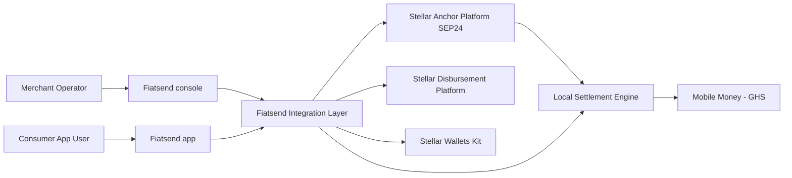

---

## 3) Integration Layer Architecture

The integration layer sits between Fiatsend product surfaces and Stellar ecosystem services. It provides:

- policy enforcement (KYB tiers, limits, route eligibility),
- idempotent orchestration and retries,
- status normalization across on-chain and off-chain states,
- auditable eventing for grant and compliance reporting.

### 3.1 New Module Structure

```text
fiatsend-app/
  src/lib/stellar/
    anchorPlatformClient.ts
    sep38Quotes.ts
    sdpClient.ts
    walletsKitAdapter.ts
    routing/
      ghsRoutePolicy.ts
      feePolicy.ts
    events/
      stellarEventNormalizer.ts
      webhookSignature.ts
```

---

## 4) Stellar Anchor Platform Integration - SEP-24 Conversion and Settlement

### 4.1 What the Anchor Platform Layer Does in Fiatsend

The Anchor Platform integration layer enables regulated settlement from Stellar assets (USDC) into local fiat rails using SEP-24 hosted deposit/withdraw and transfer lifecycle APIs. In Fiatsend, this layer is the programmable bridge from stablecoin liquidity to end-recipient mobile money destinations.

### 4.2 Off-Ramp Payment Flow

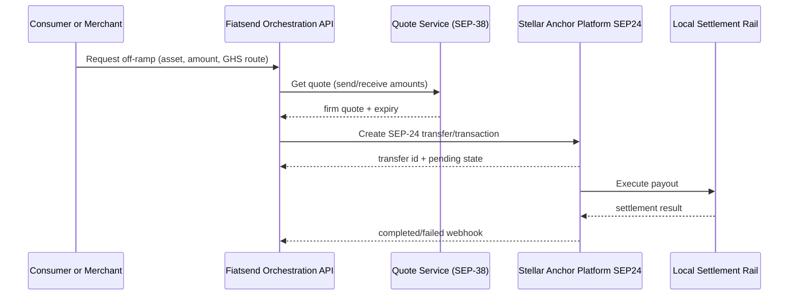

### 4.3 Anchor Platform Integration Points

- Quote acquisition and verification (`SEP-38`).
- Transfer initiation and status tracking (`SEP-24 transfer endpoints`).
- Webhook callback processing and status reconciliation in `fiatsend-functions`.
- GHS route compliance and payout rule validation before anchor submission.

### 4.4 Ghana Corridor Routing (GHS)

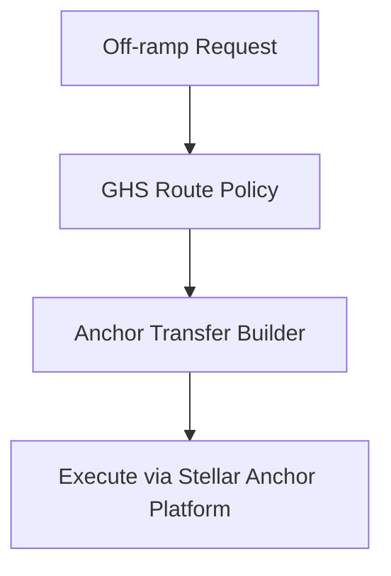

Corridor strategy: Fiatsend integrates with a GHS-capable anchor provider for USDC - GHS settlement (Yellow Card / Seevcash), with provider routing and failover managed by Fiatsend policies.

### 4.5 SEP-38 Quote Flow

- Fiatsend fetches executable quote with strict TTL.
- Quote hash and expiry are persisted for replay protection.
- Converted amount, fee, and spread are pinned to ledger entry before payout creation.
- If quote expires before transfer submit, flow restarts with new quote.

---

## 5) Stellar Disbursement Platform (SDP) - Batch Payouts

### 5.1 What SDP Does in Fiatsend

SDP orchestrates large-volume payout execution and lifecycle tracking, while Fiatsend retains recipient governance, compliance policy, and local settlement confirmation.

### 5.2 Batch Payout Flow


### 5.3 SDP Integration Points

- Batch create and item mapping.
- Lifecycle polling and callback ingestion.
- Idempotent re-submission protections.
- DLQ handling for failed provider interactions.

### 5.4 SDP Batch Processing Pipeline

- `received` -> `validated` -> `submitted_to_sdp` -> `onchain_pending` -> `onchain_complete` -> `local_settled`.
- Failed records move to `manual_review_required` with retry metadata.

---

## 6) Stellar Wallets Kit - Non-Custodial Wallet Connect

### 6.1 What Wallets Kit Does in Fiatsend

Wallets Kit provides merchant-controlled non-custodial wallet connectivity for account linking, balance visibility, and payment authorization.

### 6.2 Wallet Payment Flow

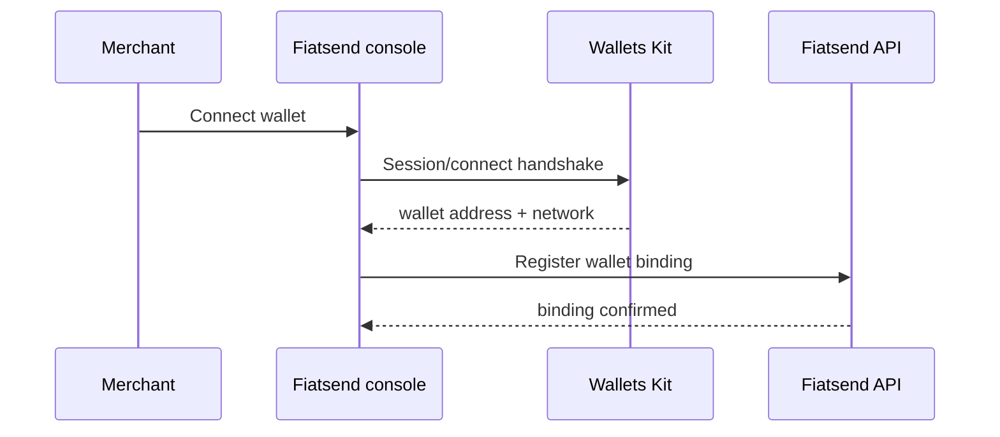

### 6.3 SDK Integration

- Client SDK in `Fiatsend console` for connect/disconnect/sign interactions.
- Signed payload verification in backend prior to persisting wallet bindings.
- Network capability checks (testnet/mainnet gates by partner tier).

### 6.4 Wallets Kit Integration Points

- Wallet binding management
- Payment authorization UX
- Signature verification APIs
- Account capability registry

---

## 7) Unified Data Model

Fiatsend uses a unified model across wallet bindings, quote snapshots, payout batches, item-level statuses, and settlement outcomes.

### 7.1 New Database Schema Additions

- `stellar_wallet_bindings`
- `offramp_quotes`
- `offramp_transfers`
- `sdp_batches`
- `sdp_batch_items`
- `ghs_route_policies`

---

## 8) API Endpoints (New)

### 8.1 Off-Ramp Endpoints

- `POST /api/stellar/offramp/quotes`
- `POST /api/stellar/offramp/transfers`
- `GET /api/stellar/offramp/transfers/:id`
- `POST /api/stellar/offramp/webhook`

### 8.2 SDP Endpoints

- `POST /api/stellar/sdp/batches`
- `GET /api/stellar/sdp/batches/:batchId`
- `POST /api/stellar/sdp/webhook`
- `POST /api/stellar/sdp/batches/:batchId/retry`

### 8.3 Wallets Kit Endpoints

- `POST /api/stellar/wallets/bind`
- `POST /api/stellar/wallets/verify-signature`
- `GET /api/stellar/wallets/:businessId`
- `POST /api/stellar/wallets/unbind`

---

## 9) Security Architecture

- strict environment isolation (`testnet` vs `mainnet` secrets and routes),
- signed webhook verification and replay windows,
- role-based and tier-based action gating,
- idempotency keys on all financial mutations,
- immutable event and audit trails for payout/payment state changes.

---

## 10) Infrastructure and Deployment

- `Fiatsend console`: UI releases with feature flags by partner cohort.
- `Fiatsend app`: orchestration APIs for wallet, anchor platform, off-ramp, and SDP adapters.
- `fiatsend-functions`: callback and reconciliation workers, backoff retries, DLQ processors.
- staged rollout:
  - tranche 1: testnet wallet + payment intent,
  - tranche 2: testnet off-ramp + SDP batches,
  - tranche 3: guarded mainnet launch with GHS volume ramp-up.

---

## 11) Technology Stack Summary

- **Frontend**: React/TypeScript (`Fiatsend console`, `Fiatsend app`)
- **Backend orchestration**: Next.js API routes + Node services
- **Async processing**: Firebase Functions scheduled and webhook workers
- **Stellar integrations**: Wallets Kit, Stellar Anchor Platform (SEP-24), SEP-compliant off-ramp APIs, SDP
- **Data and audit**: existing Fiatsend DB + event/audit records + reconciliation jobs

---

## 12) Product + Platform Context (Current State)

Fiatsend already operates a dual surface:

- **Business surface (`Fiatsend console`)**
  - Partner onboarding/KYB progression (`pending -> verified -> active`)
  - Wallet balances (`USDC`, `USDT`, `GHS`)
  - Payment terminal management and transaction history
  - Single payout and settlement configuration

- **Consumer surface (`Fiatsend app`)**
  - User authentication and wallet/deposit flows
  - Merchant payment interactions
  - Ledger and transfer activity APIs

- **Async/function surface (`fiatsend-functions`)**
  - Webhooks and long-running blockchain/settlement jobs
  - Scheduled reconciliation/indexing patterns already in production use

The Stellar program should extend this architecture, not replace it.

---

## 13) Strategic Engineering Principles

1. **Event-driven reliability over synchronous coupling**
   - Frontends should never wait for chain finality; status must be asynchronous.
2. **Dual-ledger model**
   - Keep on-chain status and off-chain local-settlement status distinct.
3. **Idempotent orchestration**
   - Every payment/payout creation endpoint accepts idempotency keys.
4. **Progressive feature flags**
   - Gate by environment, partner tier, and transaction limits.
5. **Audit-ready by default**
   - Every status transition must include source, actor, and correlation IDs.

---

## 14) Target Architecture (High-Level)

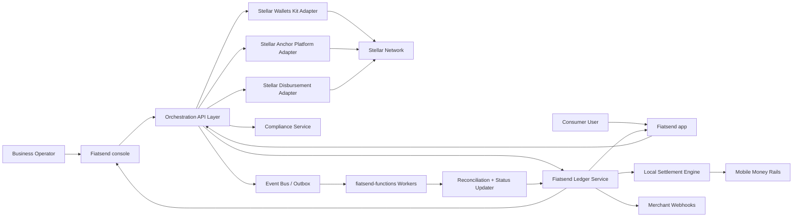

---

## 15) Component Ownership by Repository

### 15.1 `Fiatsend console` (Business UI + B2B API)

- Wallet connection UX using Stellar Wallets Kit.
- Merchant wallet profile screen (address, network, trustline, balance).
- Payment link/QR creation and payout batch upload UX.
- Status dashboard:
  - `draft`, `queued`, `onchain_pending`, `onchain_complete`, `local_settled`, `failed`.

### 15.2 `Fiatsend app` (Core orchestration + consumer app APIs)

- Merchant payment intent resolution from QR/link.
- Consumer pay flow orchestration and payment state normalization.
- Internal APIs for ledger writes, settlement routing, and webhook dispatch.
- Shared auth/session and risk policy enforcement.

### 15.3 `fiatsend-functions` (Async + integration edges)

- Webhook handlers (chain/disbursement/provider callbacks).
- Reconciliation workers and retry queues.
- Scheduled consistency checks for stale in-flight operations.

### 15.4 External dependencies

- Stellar Wallets Kit for merchant wallet session/connectivity.
- Stellar Anchor Platform (SEP-24) for hosted deposit/withdraw and transfer lifecycle.
- Stellar Disbursement Platform for disbursement job execution.
- Stellar network/Horizon/RPC for transaction visibility and confirmations.
- Existing local payout partners for fiat settlement.

---

## 16) End-to-End Domain Model

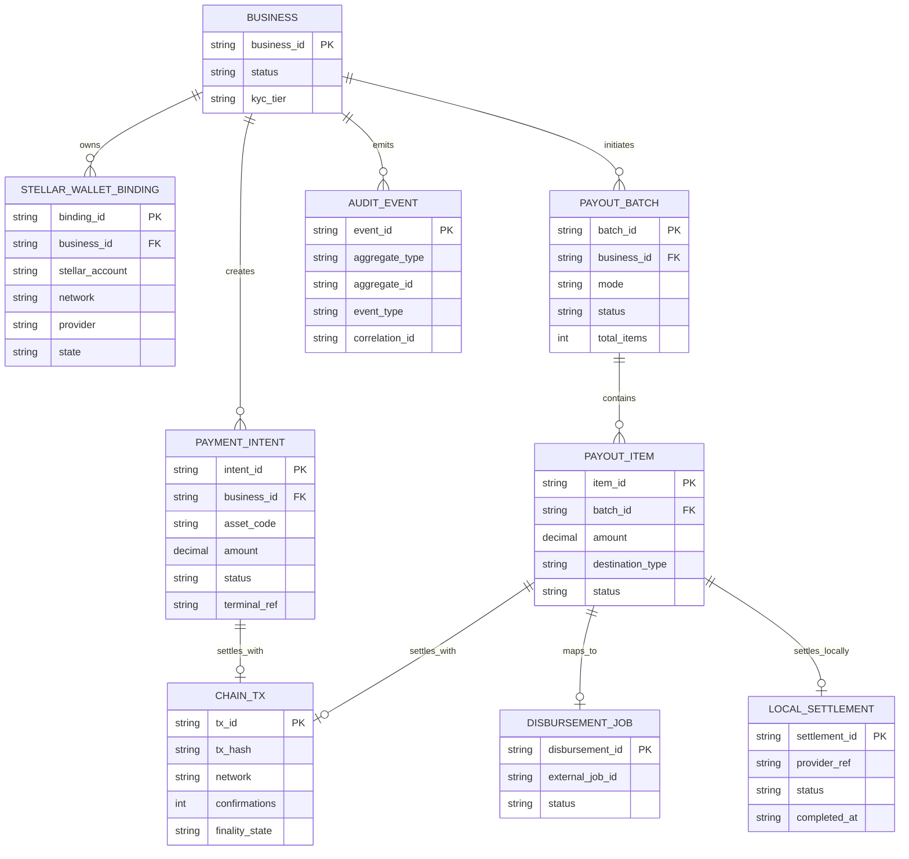

---

## 17) Wallets Kit Integration Architecture

### 17.1 Wallet Binding Flow

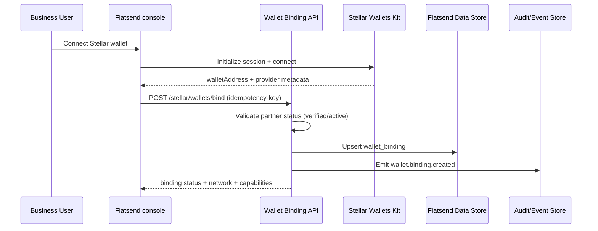

### 17.2 Guardrails

- One active wallet binding per business/environment by default.
- Require explicit rebind flow with cooldown and audit trail.
- Store provider/session metadata only; never persist wallet private keys.
- Enforce allowlist by network (`testnet`, `mainnet`) and supported assets.

---

## 18) Merchant Payment Flow Architecture (Consumer -> Business)

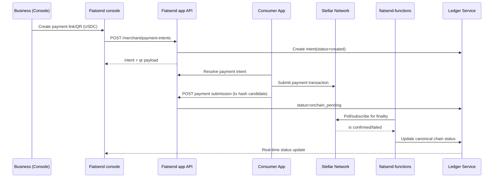

### 18.1 Payment intent API contract (proposed)

- `POST /api/merchant/payment-intents`
  - Input: `businessId`, `amount`, `assetCode`, `memo`, `terminalRef`
  - Output: `intentId`, `qrPayload`, `expiresAt`, `status`

- `POST /api/merchant/payment-intents/:intentId/submissions`
  - Input: `txHash`, `clientTimestamp`, `walletAddress`
  - Output: accepted state (`onchain_pending`)

- `GET /api/merchant/payment-intents/:intentId`
  - Output includes both chain and local normalized status.

---

## 19) SDP Payout Architecture (Business -> Recipient)

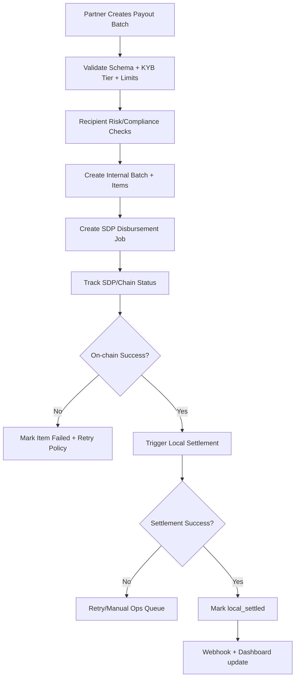

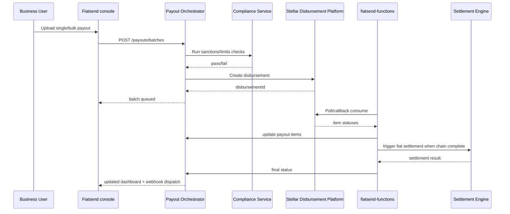

### 19.1 SDP Deployment Model and Anchor Strategy

This section defines the operational model for SEP-24 + SDP and how local-currency settlement is closed in Fiatsend's ledger.

### 19.1.1 Deployment model

- **Self-hosted SDP stack by Fiatsend** in a Fiatsend-managed cloud environment (separate testnet and mainnet deployments).
- **Rationale**:
  - direct control over KYC/compliance integrations and webhook security boundaries,
  - operational control for payout retry/reconciliation workers,
  - reduced dependency risk during milestone execution.
- **Hosted SDP option** remains a future optimization, but is not assumed in SCF43 critical path.

### 19.1.2 Anchor strategy for local-currency settlement leg

Fiatsend acts as the business integration layer to a regulated anchor/off-ramp provider (Yellowcard/Seevcash) that exposes SEP-24 deposit/withdraw and related transfer lifecycle APIs.

- **On-chain leg**: Stellar asset movement and transaction finality are tracked via SDP and chain observers.
- **Off-chain local-currency leg**: once payout state reaches `onchain_complete`, Fiatsend triggers mobile-money settlement through its local payout partners.
- **Status model**: Fiatsend keeps on-chain and local settlement statuses distinct (`onchain_complete` is not equal to `local_settled`).

### 19.1.3 Reconciliation close process (on-chain -> mobile money)

Fiatsend closes reconciliation using a dual-reference approach:

1. persist `stellar_tx_hash` / disbursement reference from SDP,
2. persist `local_provider_ref` from mobile-money rail,
3. correlate both under one internal payout item ID and immutable audit event chain.

Closure rules:

- Move to `local_settled` only when:
  - on-chain state is final/complete, and
  - local settlement provider confirms success.
- Keep `local_settlement_pending` if only one side is complete.
- Move to `local_failed` and manual operations queue on timeout/terminal provider failure.
- Run scheduled reconciliation to detect drift between:
  - SDP/chain-complete records and
  - local provider settlement confirmations.

### 19.1.4 Operational ownership and capacity

- `fiatsend-app`: API orchestration, idempotency, and payout state transitions.
- `fiatsend-functions`: webhook ingestion, retries, dead-letter processing, and scheduled reconciliation.
- Operations/compliance: exception queue handling and settlement break resolution.

No smart-contract engineering capacity is required for SCF43 delivery under this model.

---

## 20) State Machines (Canonical)

### 20.1 Payment Intent

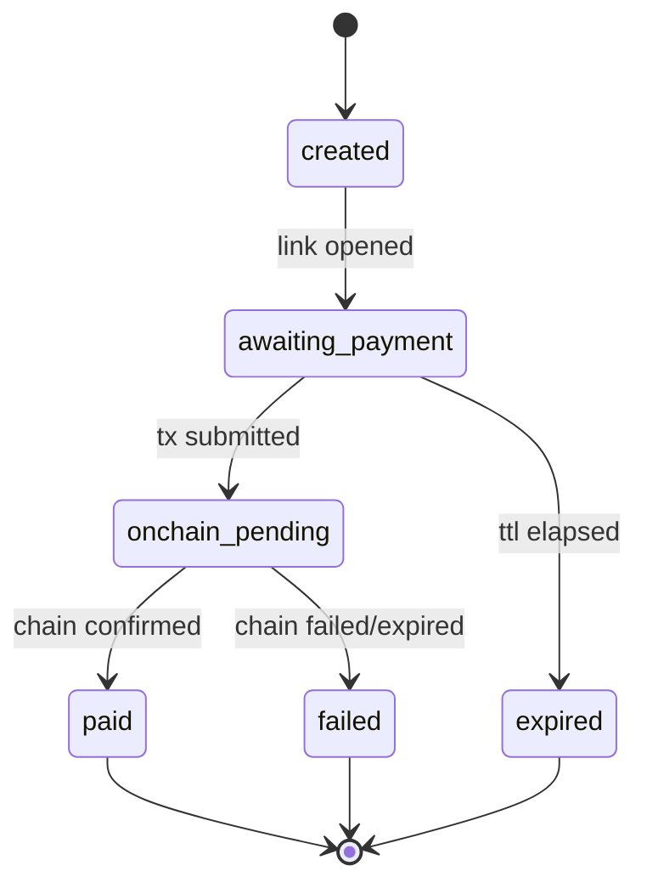

### 20.2 Payout Item

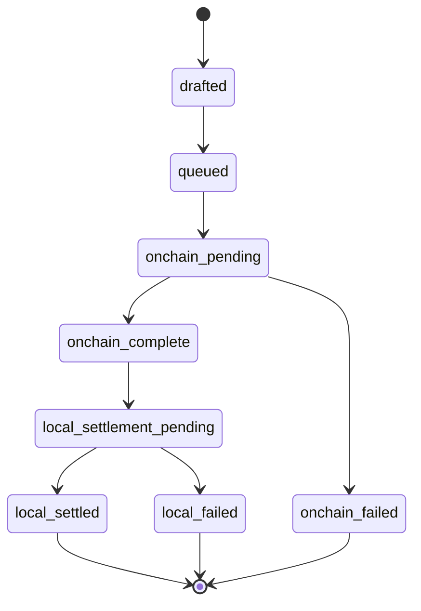

---

## 21) Reliability, Retry, and Reconciliation

### 21.1 Outbox + worker model

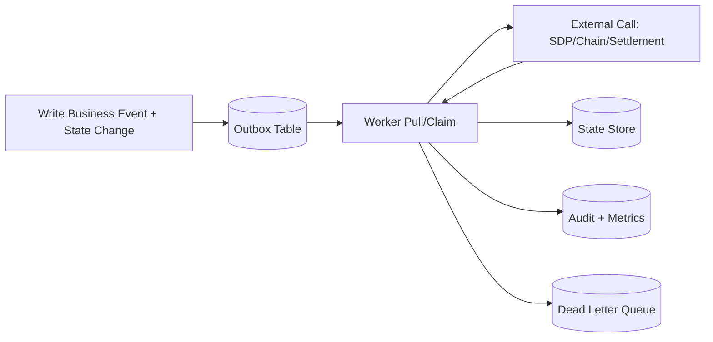

### 21.2 Policy

- Exponential retry with jitter for transient network/provider failures.
- Hard failure thresholds route items into manual operations queue.
- Scheduled reconciliation compares:
  - internal `onchain_pending` records vs chain confirmations
  - internal `local_settlement_pending` vs provider settlement status
- Idempotency keys on all create/mutate endpoints and worker handlers.

---

## 22) Security and Compliance Architecture

### 22.1 Security controls

- **AuthN/AuthZ**: partner role + status gates already used in console APIs.
- **Data protection**:
  - encrypt recipient destination identifiers at rest.
  - redact PII in logs; store only masked variants in event streams.
- **Webhook authenticity**:
  - HMAC signatures with per-partner secrets for outbound webhooks.
  - signature verification + replay window for inbound callbacks.
- **Secrets management**:
  - environment-scoped secrets only (testnet vs mainnet segregation).
- **Operational security**:
  - 2FA mandatory for production payout operators.

### 22.2 Compliance controls

- KYB level gates max payout amount, batch size, and daily velocity.
- Rule-engine decision records persisted with rule version metadata.
- Manual override requires dual-control and immutable audit event.

---

## 23) Observability and Operational Excellence

### 23.1 Telemetry standards

- Correlation IDs propagated from UI request -> orchestration -> worker -> external provider.
- Structured events by domain:
  - `wallet.binding.*`
  - `payment.intent.*`
  - `payout.batch.*`, `payout.item.*`
  - `settlement.*`

### 23.2 Key SLOs

- Payment finalization p95 (intent submission -> final state) <= 2 minutes.
- Payout status freshness p95 (external update -> console visible) <= 30 seconds.
- Reconciliation drift < 0.1% of daily volume.
- Webhook delivery success >= 99.5% (with retries).

---

## 24) Environment and Release Strategy


### 24.1 Tranche delivery mapping

- **Tranche 1 (MVP)**
  - Wallets Kit connect flow in console.
  - Merchant payment links/QR generated with Stellar metadata.
  - End-to-end demo from console to consumer payment.

- **Tranche 2 (Testnet)**
  - SDP integration for single + batch payout.
  - Reconciliation workers and payout state machine in testnet.
  - Batch test >= 20 recipients with visible status tracking.

- **Tranche 3 (Mainnet)**
  - Production rollout with guardrailed partner cohort.
  - Local settlement orchestration with operational runbooks.
  - Live transactions and measured business adoption targets.

---

## 25) Engineering Work Breakdown (Implementation Plan)

### Stream A: Wallets + Merchant Payments

1. Add wallet binding schema + migration.
2. Build Wallets Kit adapter and provider abstraction.
3. Add payment intent APIs and QR payload signing.
4. Add worker-based chain confirmation service.
5. Add payment status webhooks and dashboard feed.

### Stream B: SDP Payouts

1. Add payout batch/item/disbursement tables.
2. Build SDP adapter with strict idempotency.
3. Add compliance pre-check service integration.
4. Add local settlement trigger pipeline from on-chain completion.
5. Add reconciliation jobs + manual operations tooling.

### Stream C: Platform Readiness

1. Feature flags, partner gating, and limits config.
2. Telemetry dashboards + alerting + SLA alarms.
3. Incident playbooks and on-call handoff docs.
4. Security review, key rotation, and webhook signature hardening.

---

## 26) Risk Register

| Risk | Impact | Mitigation |
|---|---|---|
| On-chain confirmation delays | Status staleness and user confusion | Async state model + clear ETA + reconciliation pollers |
| External API instability (SDP/local rails) | Payout failures or duplicate attempts | Idempotency keys, retries with jitter, DLQ and manual queue |
| Data inconsistency across services | Financial/audit risk | Dual-write prevention, outbox pattern, nightly ledger reconciliation |
| Compliance false positives | Legitimate payout friction | Rule versioning + human review + override audit controls |
| Mainnet launch regression | Business interruption | Canary rollout by partner cohort + rollback flags |

---

## 27) Decision Log (Initial ADRs)

1. **ADR-001: Async-first orchestration**
   - Use worker-driven finalization; API requests return accepted state quickly.
2. **ADR-002: Dual-status payout model**
   - Separate `onchain_complete` from `local_settled`.
3. **ADR-003: Environment isolation**
   - Hard boundary between testnet and mainnet credentials, bindings, and limits.
4. **ADR-004: Canonical ledger events**
   - All final business state transitions must emit immutable audit events.

---

## 28) Success Criteria

### 28.1 Technical

- >= 99% successful payment intent finalization in pilot cohort.
- >= 98% payout batch item completion excluding external rail downtime windows.
- <= 0.1% reconciliation variance on daily close.

### 28.2 Product/Business (aligned to SCF trajectory)

- At least 25 businesses with active mainnet Stellar wallet bindings.
- At least 100 real production payment/payout transactions.
- At least 1 successful batch payout ($5k min) using Stellar rails with visible local settlement completion.

---

## 29) Conclusion

This architecture uses Fiatsend's current strengths (existing console controls, consumer UX, and asynchronous backend workers) to deliver a practical, production-safe Stellar rollout. The design is intentionally execution-oriented: clear ownership by repository, deterministic state models, robust reconciliation, and phased delivery gates aligned to SCF milestones.
