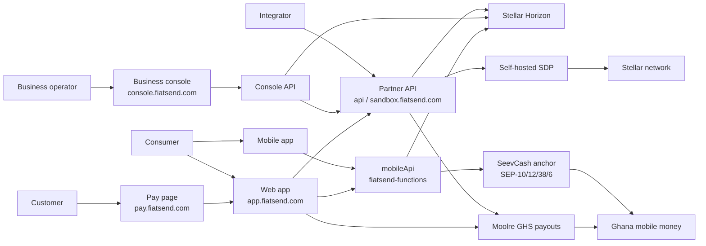
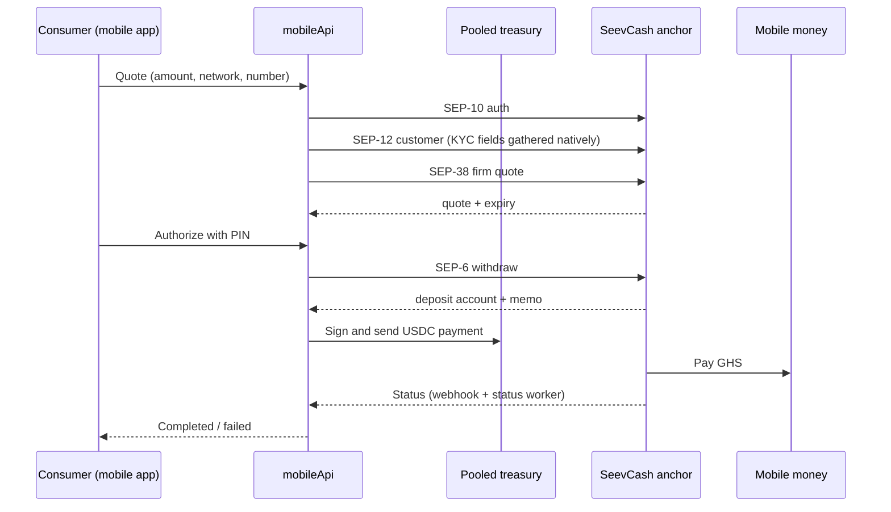
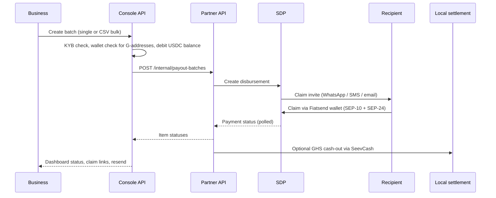
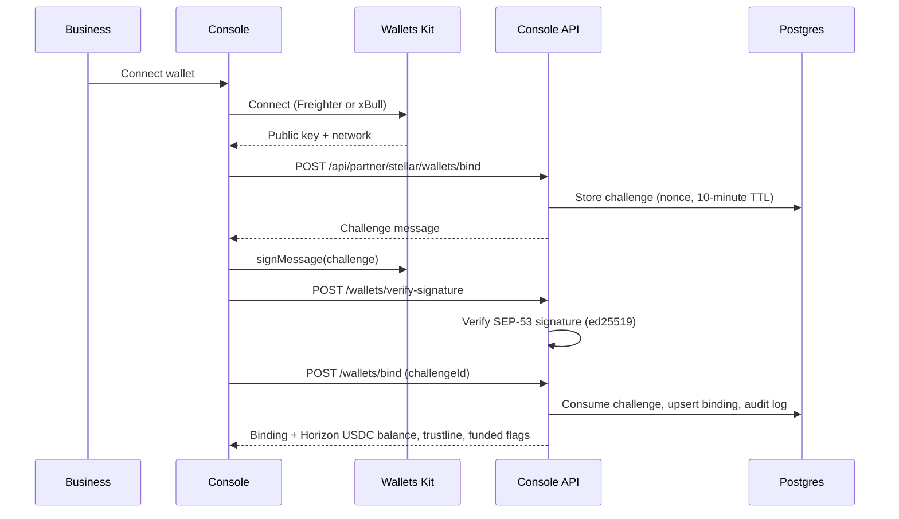
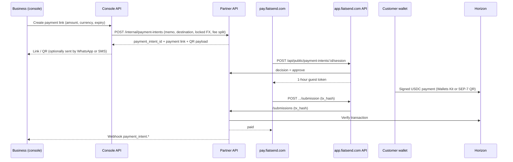
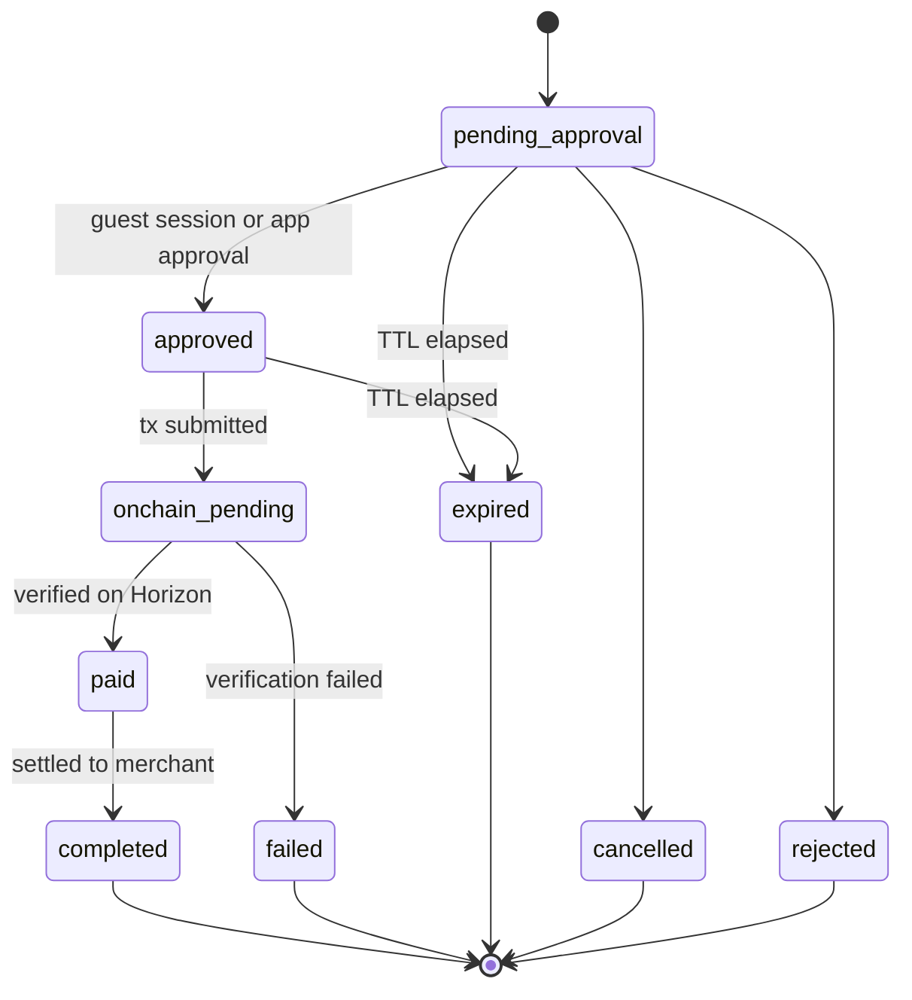
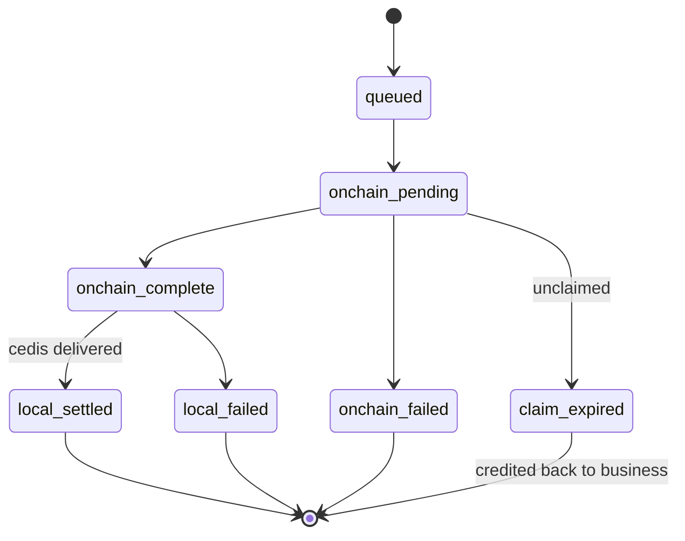

# Fiatsend x Stellar: Technical Architecture

**Status:** as built, 9 October 2026. This revision replaces the May 2026 plan with the architecture that is running today. Where the build differs from the plan, the difference and its reason are recorded in §17 and the Appendix.

## 1) Executive Brief

Fiatsend's Stellar integration is live on mainnet across payment acceptance, business treasury deposits, SDP single and bulk payouts, and consumer cash-out to mobile money, and has processed live transactions. Three changes from the plan matter most:

1. **Anchor:** Fiatsend does not run its own Stellar Anchor Platform, and there is no MoneyGram (SEP-24) integration. Fiatsend integrates as a SEP client of **SeevCash**, a Ghana anchor, using SEP-10, SEP-12, SEP-38 and SEP-6, which is live.
2. **Payment verification:** on-chain verification of USDC payments runs inside the Partner API against Horizon, with a reconciliation job every minute, rather than in `fiatsend-functions`.
3. **Ledger:** there is no single Ledger Service yet. Business balances live in the console database, consumer balances in Firestore, and partner virtual accounts in the Partner API database. A unified ledger remains on the roadmap (§17).

What is live, by surface:

| Capability | Surface | Stellar components | Status |
|---|---|---|---|
| Merchant wallet connect | Business console | Stellar Wallets Kit (Freighter, xBull), SEP-53 signed-message proof | Live (mainnet when enabled per environment) |
| Payment links and QR | Console → Partner API → pay.fiatsend.com | Wallets Kit (Freighter, Albedo, xBull), SEP-7 `web+stellar:pay` QR, Horizon verification | Live |
| Website checkout (buttons, embed, API) | Console, Partner API, pay page | Same as payment links | Live |
| Invoices with mobile money / bank transfer | Console public invoice page | None (manual confirmation) | Live |
| Business USDC deposits | Console | Pooled treasury account + per-business memo, Horizon watcher | Live |
| Consumer USDC cash-out to mobile money | Mobile app → `mobileApi` | SeevCash SEP-10 / 12 / 38 / 6 from a pooled treasury | Live |
| Single and bulk payouts | Console → Partner API → SDP | Self-hosted Stellar Disbursement Platform, SEP-10/24 receiver claim | Live |

Local mobile-money settlement in Ghana (MTN, Telecel, AirtelTigo) stays on Fiatsend's existing rails (Moolre for GHS payouts, SeevCash for USDC→GHS). On-chain completion is never treated as local delivery (§11).

---

## Table of Contents

1. Executive Brief
2. System Architecture (As Built)
3. Repositories and Runtime
4. Anchor Integration: SeevCash (SEP-10, 12, 38, 6)
5. Stellar Disbursement Platform (SDP) Payouts
6. Stellar Wallets Kit and Wallet Binding
7. Payment Acceptance: Payment Intents, Pay Page, Checkout, Invoices
8. Deposits and Treasury
9. Data Model
10. API Surfaces
11. State Machines
12. Reliability, Retry and Reconciliation
13. Security and Compliance
14. Observability
15. Infrastructure and Deployment
16. Tranche Delivery Status
17. Known Gaps and Roadmap
18. Success Criteria
19. Decision Log
Appendix: Changes from the May 2026 Plan

---

## 2) System Architecture (As Built)

```mermaid
flowchart LR
    Biz[Business operator] --> Console[Business console<br/>console.fiatsend.com]
    Payer[Customer] --> Pay[Pay page<br/>pay.fiatsend.com]
    Consumer[Consumer] --> Web[Web app<br/>app.fiatsend.com]
    Consumer --> Mobile[Mobile app]
    Dev[Integrator] --> PAPI[Partner API<br/>api / sandbox.fiatsend.com]

    Console --> CAPI[Console API]
    CAPI --> PAPI
    Pay --> Web
    Web --> PAPI
    Mobile --> MAPI[mobileApi<br/>fiatsend-functions]
    Web --> MAPI

    PAPI --> Horizon[Stellar Horizon]
    PAPI --> SDP[Self-hosted SDP]
    CAPI --> Horizon
    MAPI --> Horizon
    MAPI --> Seev[SeevCash anchor<br/>SEP-10/12/38/6]
    SDP --> Stellar[Stellar network]
    Seev --> MoMo[Ghana mobile money]
    PAPI --> Moolre[Moolre GHS payouts]
    Web --> Moolre
    Moolre --> MoMo
```

Key properties of the build:

- **Non-custodial for merchants.** Merchants receive USDC payments directly into their own bound Stellar wallet. Fiatsend stores only the public key.
- **Pooled custody for deposits and consumers.** Business deposits and consumer USDC balances use pooled treasury accounts with per-account memo IDs. Consumer and partner memo ranges are separated (partner memos start at 1,000,000).
- **Server-held consumer wallets.** The mobile app signs nothing on the device; the server checks the user's PIN and pays from the pooled treasury. Keys for server-held wallets are wrapped with Cloud KMS.
- **Testnet/mainnet switch requires two flags.** Every surface uses a network setting plus an explicit "allow mainnet" flag; without both it stays on testnet.

---

## 3) Repositories and Runtime

| Repository | Role | Runtime |
|---|---|---|
| `fiatsend-console` | Business dashboard (React) and console API (Express): wallet binding, payment links, checkout, invoices, deposits, payouts UI, admin tools | Vercel (frontend) + Cloud Run `fiatsend-console-api` + Cloud SQL Postgres |
| `fiatsend-partner-api` | External API (`/v1`), payment intents and on-chain verification, payout batches to SDP, webhooks, virtual accounts | Cloud Run (`fiatsend-prod-api` mainnet, `fiatsend-sandbox-api` sandbox) + Postgres |
| `fiatsend-pay` | Customer checkout page for payment intents (Wallets Kit, SEP-7 QR, embed mode) | Vercel, pay.fiatsend.com |
| `fiatsend-main` | Consumer web app and public payment-intent session routes; custodial ledgers; Moolre cash-out | Vercel, app.fiatsend.com + Firestore |
| `fiatsend-functions` | `mobileApi` for the mobile app; SeevCash cash-out; SDP receiver claim; deposit watchers; webhook receivers; schedulers | Firebase Cloud Functions gen2, us-central1 |
| `fiatsend-mobile` | Consumer mobile app (Expo); talks only to `mobileApi` | EAS builds + over-the-air updates |
| `stellar-disbursement-platform-backend` | Fiatsend-patched SDP (pooled receiver address with memos; WhatsApp/SMS/email channels; registration-link and pending-claims endpoints) | GKE Autopilot + Cloud SQL (testnet and mainnet) |
| `fiatsend-admin` | Internal operations: approvals queue (maker-checker), treasury sweeps, withdrawal review, RBAC | Vercel |
| `developer-portal` | API reference at developer.fiatsend.com | Cloudflare Workers |
| `docs` | Product and integration docs at docs.fiatsend.com | Vercel |

---

## 4) Anchor Integration: SeevCash (SEP-10, 12, 38, 6)

### 4.1 What the anchor layer does

The anchor layer converts USDC on Stellar into Ghana cedis paid to mobile money. Fiatsend is a **SEP client** of SeevCash; it does not operate an Anchor Platform. The client code lives in `fiatsend-functions` (`stellarCashout`, `ramp/anchorClient`) for the mobile app and in `fiatsend-main` (`lib/stellar/anchors`) for the web.

### 4.2 Mobile cash-out flow (programmatic SEP-6)

```mermaid
sequenceDiagram
    participant User as Consumer (mobile app)
    participant API as mobileApi
    participant T as Pooled treasury
    participant A as SeevCash anchor
    participant MM as Mobile money

    User->>API: Quote (amount, network, number)
    API->>A: SEP-10 auth
    API->>A: SEP-12 customer (KYC fields gathered natively)
    API->>A: SEP-38 firm quote
    A-->>API: quote + expiry
    User->>API: Authorize with PIN
    API->>A: SEP-6 withdraw
    A-->>API: deposit account + memo
    API->>T: Sign and send USDC payment
    A->>MM: Pay GHS
    A-->>API: Status (webhook + status worker)
    API-->>User: Completed / failed
```

- KYC and mobile-money details are collected in the app's own screens, then sent to the anchor through SEP-12. SeevCash's hosted SEP-24 form was replaced with this SEP-6 flow because it was unreliable for this use.
- The quote is firm and time-limited (SEP-38); an expired quote restarts the flow.
- Status arrives through a signed SeevCash webhook and a status worker that polls every 2 minutes.
- A salary auto-cash-out path uses the same flow for SDP payouts that recipients choose to receive in cedis.

### 4.3 Other anchor paths

| Path | Status |
|---|---|
| SeevCash SEP-24 interactive withdraw (web) | Built, behind a feature flag; workers off on mainnet by default |
| MoneyGram SEP-24 deposit/withdraw | Not used; SeevCash SEP-6 covers cash-out |
| SEP-31 cross-border | Not built |
| Fiatsend as an anchor (own SEP-10/24/38 endpoints) | Not built; SDP provides SEP-10/24 for receiver claims only |

---

## 5) Stellar Disbursement Platform (SDP) Payouts

### 5.1 What SDP does in Fiatsend

SDP executes single and bulk USDC disbursements. Fiatsend keeps recipient management, balance checks, claim invitations and local settlement.

### 5.2 Payout flow (as built)

```mermaid
sequenceDiagram
    participant Biz as Business
    participant C as Console API
    participant P as Partner API
    participant S as SDP
    participant R as Recipient
    participant L as Local settlement

    Biz->>C: Create batch (single or CSV bulk)
    C->>C: KYB check, wallet check for G-addresses, debit USDC balance
    C->>P: POST /internal/payout-batches
    P->>S: Create disbursement
    S->>R: Claim invite (WhatsApp / SMS / email)
    R->>S: Claim via Fiatsend wallet (SEP-10 + SEP-24)
    S-->>P: Payment status (polled)
    P-->>C: Item statuses
    P->>L: Optional GHS cash-out via SeevCash
    C-->>Biz: Dashboard status, claim links, resend
```

- **Recipients:** phone, email or Stellar address; the destination type is inferred. Bulk upload is a CSV (`amount, recipient, memo, reference, date_of_birth`).
- **Balance first:** the console debits the business's USDC balance before submitting, and refunds it if submission fails.
- **First-time recipients:** receive a claim link; the receiver wallet is Fiatsend's pooled address with a per-user memo (enabled by Fiatsend's SDP patch). Unclaimed payments expire and are credited back to the business.
- **Controls:** pause and resume a batch, resend a claim invite, copy a claim link.
- **Reconciliation:** SDP payment IDs are matched to SeevCash references; matched and unmatched items are visible in the admin Stellar Tranche 3 page.

### 5.3 SDP deployment

| Environment | Deployment | Status |
|---|---|---|
| Testnet | GKE Autopilot, Helm chart, Cloud SQL, patched SDP image | Live (sandbox) |
| Mainnet | `sdp.fiatsend.com` / `sdp-admin.fiatsend.com`, same image, `NETWORK_TYPE: mainnet`, distribution account funded by the business | Live; tested with live transactions from the console |

The SDP fork's two Fiatsend changes (pooled receiver address with distinct memos; WhatsApp, SMS and email channels plus registration-link and pending-claims endpoints) should be pushed to a Fiatsend-owned remote (§17).

---

## 6) Stellar Wallets Kit and Wallet Binding

### 6.1 What the binding does

A business connects its own Stellar wallet in the console. Payment links then pay directly into that wallet. Fiatsend stores only the public key.

### 6.2 Binding flow (SEP-53 signed message)

```mermaid
sequenceDiagram
    participant B as Business
    participant UI as Console
    participant WK as Wallets Kit
    participant API as Console API
    participant DB as Postgres

    B->>UI: Connect wallet
    UI->>WK: Connect (Freighter or xBull)
    WK-->>UI: Public key + network
    UI->>API: POST /api/partner/stellar/wallets/bind
    API->>DB: Store challenge (nonce, 10-minute TTL)
    API-->>UI: Challenge message
    UI->>WK: signMessage(challenge)
    UI->>API: POST /wallets/verify-signature
    API->>API: Verify SEP-53 signature (ed25519)
    UI->>API: POST /wallets/bind (challengeId)
    API->>DB: Consume challenge, upsert binding, audit log
    API-->>UI: Binding + Horizon USDC balance, trustline, funded flags
```

- **Wallets:** Freighter and xBull. Albedo is excluded in the console because it cannot sign the bind message; the customer pay page supports Freighter, Albedo and xBull because it signs transactions, not messages.
- **Guardrails:** one active binding per business per network; the client checks the wallet is on the expected network; every step is audit-logged and rate-limited; unbind is explicit.
- **Mainnet requirements for payment links:** the bound account must be funded and hold a USDC trustline.
- **Access gating:** by environment (sandbox → testnet), an allow-mainnet flag, and a partner access mode (all active partners, allowlist, or admin only).

---

## 7) Payment Acceptance: Payment Intents, Pay Page, Checkout, Invoices

### 7.1 Payment link flow

```mermaid
sequenceDiagram
    participant Biz as Business (console)
    participant C as Console API
    participant P as Partner API
    participant Pay as pay.fiatsend.com
    participant Web as app.fiatsend.com API
    participant W as Customer wallet
    participant H as Horizon

    Biz->>C: Create payment link (amount, currency, expiry)
    C->>P: POST /internal/payment-intents (memo, destination, locked FX, fee split)
    P-->>C: payment_intent_id + payment link + QR payload
    C-->>Biz: Link / QR (optionally sent by WhatsApp or SMS)
    Pay->>Web: POST /api/public/payment-intents/:id/session
    Web->>P: decision = approve
    Web-->>Pay: 1-hour guest token
    W->>H: Signed USDC payment (Wallets Kit or SEP-7 QR)
    Pay->>Web: POST .../submission (tx_hash)
    Web->>P: /submissions (tx_hash)
    P->>H: Verify transaction
    P-->>Pay: paid
    P-->>Biz: Webhook payment_intent.*
```

- **Currencies:** intents can be priced in GHS or USDC; GHS intents show a locked FX rate and the customer pays USDC.
- **Expiry:** businesses choose 1 hour, 6 hours, 24 hours, 3 days or 7 days (default 7 days). Expiry is applied when an intent is read; an intent already in `onchain_pending` does not expire.
- **Fees:** the business chooses who pays the platform fee (business or customer).
- **Pay page:** polls every 3 seconds while `onchain_pending`, shows an expiry countdown, and supports an embed mode (`?embed=1`) that reports status to the parent page with `postMessage` and honours `success_url` / `cancel_url`.
- **Logged-in consumers** can also pay from their Fiatsend GHS balance in the web app; that path settles between Fiatsend balances and does not move USDC on-chain.

### 7.2 On-chain verification (Partner API)

| Check | As built |
|---|---|
| Transaction | Successful and in a closed ledger on the intent's network |
| Memo | Text memo equals the intent's Stellar memo (derived from `merchant_reference`) |
| Destination | Payment operation to the merchant's bound account |
| Asset | Asset code and issuer match the allowlisted USDC issuer for the network |
| Amount | At least the intent amount; underpayment is rejected |
| Timing | Transaction not older than the intent (2-minute skew allowed) |
| Replay | A transaction hash already used by another intent is rejected |
| Missed submissions | A Cloud Scheduler job calls `/internal/payment-intents/reconcile-onchain` every minute and matches recent payments by memo, with 2 minutes of grace after expiry |

### 7.3 Website checkout

- **Payment buttons:** reusable checkout links per product or price, with a public page per link.
- **Embed:** `fiatsend-checkout.js` opens checkout in a popup from the merchant's own button.
- **API:** `POST/GET /api/v1/checkout/sessions` on the console, proxied as `/v1/checkout/sessions` on the Partner API.
- **Webhook:** `checkout.session.completed`, signed with HMAC-SHA256.
- Checkout sessions are stored as invoices (`source = 'checkout'`), so the same payment methods and confirmation rules apply.

### 7.4 Invoices and manual payment methods

- Invoices and payment links can accept **Pay online with Fiatsend**, **mobile money** and **bank transfer**.
- For mobile money and bank transfer, the customer pays the business directly and submits a claim (optional transaction ID); the business confirms or rejects it, and the customer is emailed if a claim is rejected.
- Open invoices are checked for online payment on each cron tick.

---

## 8) Deposits and Treasury

### 8.1 Business USDC deposits (console)

- Each business gets a memo ID on a pooled business treasury account; the console also shows the equivalent muxed address.
- A watcher polls Horizon payments from a saved cursor. Cloud Scheduler triggers it every minute (two passes about 25 seconds apart), and businesses can trigger a manual sync.
- A matched payment is credited in one database transaction, idempotent per payment, and the business is emailed. Payments with an unknown partner-range memo go to an admin queue to assign or dismiss.
- A database trigger writes every balance change to `partner_balance_audit`.
- Businesses can also deposit USDC or USDT on Polygon and BSC to per-business custodial EVM addresses.

### 8.2 Consumer deposits (functions and web app)

- **Stellar:** a pooled treasury with consumer memo IDs; a watcher in `fiatsend-functions` polls Horizon every 2 minutes, credits exactly once, and records unmatched payments.
- **EVM:** USDT/USDC deposits on BSC and Polygon are detected by webhooks, block scanners and confirmation workers, then credited to the Firestore ledger.

### 8.3 Treasury operations

- Sweeps, withdrawal reviews and batch sweeps run from the admin console and require a second approver (maker-checker approvals queue).
- Business swaps from USDC/USDT to the internal GHS balance are available in production with a 3% fee and credit only what was actually swept.

---

## 9) Data Model

Main tables and collections in use:

| Store | Tables / collections | Purpose |
|---|---|---|
| Console Postgres | `partners` (balances per currency and environment, `stellar_memo_id`, payment-link settings) | Business accounts and balances |
| | `stellar_wallet_bindings`, `stellar_bind_challenges` | Wallet binding |
| | `stellar_memo_counters`, `stellar_deposit_cursors`, `stellar_unmatched_deposits` | Pooled deposits |
| | `partner_invoices`, `partner_invoice_customers`, `partner_invoice_settings`, `partner_invoice_claims`, `partner_checkout_links` | Invoices, payment links with manual methods, website checkout |
| | `partner_balance_audit`, `audit_log`, `system_pause_state` | Audit and emergency pause |
| Partner API Postgres | `payment_intents`, `payout_batches`, payout items, `api_keys`, webhooks, virtual accounts and ledger entries | Intents, payouts, integrations |
| Firestore | User ledgers (GHS and stablecoins), withdrawals, guest payment sessions, `engagement_inbox`, `saved_recipients`, unmatched Stellar deposits | Consumer accounts |
| SDP Postgres | Upstream SDP schema plus Fiatsend's pooled-address change | Disbursements and receivers |

The console schema also contains `stellar_payout_batches`, `stellar_payout_items` and `sdp_disbursement_jobs` from the original plan; payout data is held by the Partner API, and these console tables are unused.

---

## 10) API Surfaces

| Surface | Base URL | Auth |
|---|---|---|
| Partner API | `https://api.fiatsend.com/v1` | `Authorization: Bearer fs_live_*` |
| Partner API (sandbox) | `https://sandbox.fiatsend.com/v1` | `Authorization: Bearer fs_test_*` |
| Console API | `https://console.fiatsend.com/api` | Session cookie (team roles) |
| Consumer web API | `https://app.fiatsend.com/api` | Session; public payment-intent routes use a guest token |
| Mobile API | Cloud Functions `mobileApi` | Mobile session |

### 10.1 Partner API (`/v1`)

| Group | Routes |
|---|---|
| Health and reference | `GET /health`, `/rates`, `/supported-networks`, `/limits` |
| Withdrawals (GHS mobile money) | `POST /withdrawals`, `GET /withdrawals/:id`, `GET /transactions` |
| Payment intents | `POST /payment-intents`, `GET /payment-intents/:id`, `POST /payment-intents/:id/cancel`, `POST /payment-intents/:id/submissions` |
| Payout batches (SDP) | `POST /payout-batches`, `GET /payout-batches`, `GET /payout-batches/:id` |
| Virtual accounts | `GET /accounts`, `GET /accounts/:id/ledger` |
| Checkout sessions | `POST /checkout/sessions`, `GET /checkout/sessions/:id` |
| Webhooks | `POST /webhooks`, `GET /webhooks`, `DELETE /webhooks/:id`, `GET /webhook-deliveries[/:event_id]` |

Idempotency uses body fields: `reference_id` for withdrawals and payout items, `merchant_reference` for payment intents; a repeat returns `200` with the original record. Internal routes (`/internal/*`, internal token) serve the console, web app and schedulers: payment-intent create, decision, submissions and on-chain reconciliation; payout-batch sync, pause and resume; local settlement; Stellar metrics; SeevCash webhook.

### 10.2 Console API (selected)

| Group | Routes |
|---|---|
| Wallet binding | `GET /api/partner/stellar/wallets`, `POST /wallets/bind`, `/wallets/verify-signature`, `/wallets/unbind` |
| Payment links | `POST /api/partner/stellar/payment-intents`, notify (WhatsApp/SMS), `GET /api/partner/stellar/ghs-quote` |
| Payouts | `POST/GET /api/partner/stellar/payout-batches`, pause/resume, claim link, resend invite, payout credits, recipient book |
| Deposits | `/api/partner/deposit/sync`, `/api/internal/stellar/deposits/scan` (scheduler) |
| Invoices and checkout | `/api/partner/invoices/*`, `/api/partner/payment-links`, `/api/partner/checkout/links|sessions`, public `/api/public/invoices/:token`, `/api/public/checkout/:token` |
| Checkout API | `POST/GET /api/v1/checkout/sessions` (API key) |
| Account | auth with 2FA, KYB via Didit, team and roles, API keys, webhooks, settings |

### 10.3 Mobile API (`mobileApi`, selected groups)

Auth and 2FA; profile and mobile money; custodial balances and deposit addresses; USDT/USDC to GHS conversion; Stellar cash-out (`/cashout/stellar/*`: info, wallet, quote, profile, authorize, start, status, history, salary); SDP claims (`/stellar/sdp/claims/pending`, `/stellar/sdp/claim/start`); merchant payment intents; withdrawals; notification inbox (`/me/notifications`); saved recipients (`/me/recipients`); internal treasury operations used by the admin console.

### 10.4 Inbound provider webhooks

| Source | Receiver |
|---|---|
| SeevCash | `seevcashWebhookReceiver` (signature verified) and Partner API `/internal/webhooks/seevcash` |
| Didit (KYC/KYB) | `diditWebhookReceiver`, console `/api/webhooks/didit-kyb` (HMAC, 300-second window) |
| Moolre | Web app `/api/webhooks/moolre` |
| EVM deposits | Alchemy/Blockradar webhook receivers |
| SDP | Not a webhook: statuses are polled every minute |

---

## 11) State Machines

### 11.1 Payment intent (Partner API)

```mermaid
stateDiagram-v2
    [*] --> pending_approval
    pending_approval --> approved : guest session or app approval
    approved --> onchain_pending : tx submitted
    onchain_pending --> paid : verified on Horizon
    onchain_pending --> failed : verification failed
    paid --> completed : settled to merchant
    pending_approval --> cancelled
    pending_approval --> rejected
    pending_approval --> expired : TTL elapsed
    approved --> expired : TTL elapsed
    completed --> [*]
    failed --> [*]
    expired --> [*]
    cancelled --> [*]
    rejected --> [*]
```

### 11.2 Payout item (SDP)

```mermaid
stateDiagram-v2
    [*] --> queued
    queued --> onchain_pending
    onchain_pending --> onchain_complete
    onchain_pending --> onchain_failed
    onchain_pending --> claim_expired : unclaimed
    onchain_complete --> local_settled : cedis delivered
    onchain_complete --> local_failed
    claim_expired --> [*] : credited back to business
    local_settled --> [*]
    onchain_failed --> [*]
    local_failed --> [*]
```

`onchain_complete` never implies `local_settled`. The merchant-facing `completed` status for a withdrawal means local delivery.

### 11.3 Mobile cash-out

`quoted` → `authorized` → `submitted` (USDC sent to the anchor) → `pending_anchor` → `completed` | `failed`, following the SeevCash transaction status.

---

## 12) Reliability, Retry and Reconciliation

| Mechanism | As built |
|---|---|
| Idempotency | Body references on all money-moving creates; deposit credits idempotent per payment; one-time challenge consumption |
| On-chain reconciliation | Partner API reconcile job every minute for payment intents |
| Deposit watchers | Console every minute; functions every 2 minutes; unmatched deposits queued for admin |
| SDP status | Polled every minute (`sdpPollWorker`) |
| Local settlement | `localSettlementWorker` every minute; `payoutReconciliationWorker` and `withdrawalEscalationWorker` every 5 minutes |
| Withdrawal retries | Web app cron retries failed Moolre payouts |
| Outbound webhooks | In-process delivery with 3 attempts; see 12.1 |
| Emergency pause | Admin can pause all fund-moving routes in the console |

There is no shared outbox or dead-letter queue yet; failures surface in admin queues, Slack alerts and escalation workers (§17).

### 12.1 Outbound webhook contract

| Item | Partner API | Console checkout |
|---|---|---|
| Signature | `X-Fiatsend-Signature: sha256=<hex>` (HMAC-SHA256 over the raw body) | `X-Fiatsend-Signature: <hex>` (HMAC-SHA256) |
| Event header | `X-Fiatsend-Event` | `X-Fiatsend-Event` |
| Delivery ID | `X-Fiatsend-Delivery` | Not sent |
| Retries | 3 attempts, about 1 s then 4 s apart, 10 s timeout | 3 attempts, 1 s then 4 s, 8 s timeout, HTTPS only |

Unifying the two formats is on the roadmap (§17). Receivers should verify the signature, deduplicate on event ID and treat the latest status as authoritative.

---

## 13) Security and Compliance

**Built:**

- **KYB and KYC:** Didit for businesses (console) and consumers (web and mobile); verified status gates money movement.
- **Authentication:** console 2FA by SMS/WhatsApp or email OTP; mobile PIN and 2FA; Cloudflare Turnstile on console signup and password reset.
- **Authorization:** console team roles (owner, admin, finance, developer, viewer) with per-route permissions; admin console RBAC with nine roles and a maker-checker approvals queue for payouts, manual credits, deposit recovery, sweeps and Stellar withdrawals.
- **Keys:** merchants keep their own keys (non-custodial binding); server-held consumer wallet keys are wrapped with Cloud KMS; API keys are stored hashed.
- **Integrity:** signed webhooks in and out; one-time signed wallet challenges; replay protection on transaction hashes; balance audit trigger; audit log of console actions.
- **Network isolation:** separate testnet and mainnet configuration on every surface, with a two-flag switch.
- **Edge:** the console API sits behind Cloudflare with an origin secret, WAF rules and rate limits on signup and login.

Gaps are listed in §17.

---

## 14) Observability

- Structured JSON logs per component in Cloud Run and Cloud Functions.
- Slack alerts for withdrawals, deposits, authentication and console events.
- SDP exposes Prometheus metrics.
- Admin "Stellar Tranche 3" page: connected businesses, real transactions (paid intents plus on-chain-complete payout items), explorer links, SDP ↔ SeevCash reconciliation, SEP-6 cash-out reconciliation, pilot feedback, and address export for on-chain analytics.

Alert policies, on-call paging and end-to-end correlation IDs are not in place yet (§17).

---

## 15) Infrastructure and Deployment

| Component | Deployment |
|---|---|
| Console | Vercel frontend; Cloud Run API deployed from source; Cloud SQL Postgres; migrations applied by hand |
| Partner API | Cloud Run (mainnet and sandbox services); Cloud Scheduler for reconciliation |
| Functions | Firebase CLI deploy of `mobileApi`, webhook receivers and schedulers |
| Web app, pay page, admin, docs | Vercel |
| Developer portal | Cloudflare Workers |
| Mobile | EAS store builds; over-the-air updates for JavaScript changes |
| SDP | Helm on GKE Autopilot with Cloud SQL |

Continuous integration runs for the console and mobile repositories (lint, typecheck, tests). Other services are deployed manually.

---

## 16) Tranche Delivery Status

| Tranche | Scope | Status |
|---|---|---|
| 1 (MVP) | Wallets Kit connect in console; payment links/QR with Stellar metadata; end-to-end console → customer payment | Delivered |
| 2 (Testnet) | SDP single and bulk payouts with claim flow; reconciliation; SeevCash anchor integration | Delivered on testnet |
| 3 (Mainnet) | Payment links on mainnet with on-chain verification; pooled deposits; SeevCash SEP-6 cash-out; website checkout; SDP on mainnet | Delivered: all live on mainnet and tested with live transactions |

---

## 17) Known Gaps and Roadmap

| Area | Gap | Next step |
|---|---|---|
| Ledger | Balances live in three stores (console Postgres, partner-API Postgres, Firestore) | Introduce a ledger service that owns balance changes and emits events |
| Async reliability | No shared outbox or dead-letter queue | Outbox table plus worker for webhooks and provider calls |
| Payout controls | No per-tier limits, approval for large batches, or automated retry in the console | Add tier limits and dual approval before SDP submit |
| Console MoMo payout | The console's direct mobile-money payout route is not connected to a live rail | Route through the Partner API withdrawal flow |
| Webhooks | Two signature formats; no timestamp header | One contract with delivery ID and timestamp |
| Verification | No confirmation threshold beyond one closed ledger | Make the threshold configurable per network |
| Security | Field-level encryption of recipient identifiers, scheduled secret rotation, alert policies | Add in that order |
| Engineering | CI only on console and mobile; SDP fork changes not pushed to a Fiatsend remote | CI for all services; push the SDP fork |
| Anchors | One GHS anchor (SeevCash) | Add a second anchor for failover |

---

## 18) Success Criteria

Targets tracked on the admin Stellar Tranche 3 page:

| Metric | Target |
|---|---|
| Businesses with an active mainnet Stellar wallet binding | 25 |
| Real production transactions (paid intents plus on-chain-complete payout items) | 100 |
| Successful batch payout volume using Stellar rails with local settlement | 5,000 USDC |
| Payment intent finalization in the pilot cohort | ≥ 99% |
| Payout item completion, excluding rail downtime | ≥ 98% |

---

## 19) Decision Log

1. **ADR-001 Async-first.** Payments and payouts return quickly and finalize through workers and reconciliation jobs.
2. **ADR-002 Dual status for payouts.** `onchain_complete` is kept separate from `local_settled`.
3. **ADR-003 Environment isolation.** Separate testnet and mainnet configuration; mainnet needs two explicit flags.
4. **ADR-004 Audit by default.** Money-moving actions and balance changes are written to audit records.
5. **ADR-005 SEP client of SeevCash instead of a self-hosted Anchor Platform.** Faster to production in Ghana, and Fiatsend avoids operating anchor infrastructure. No MoneyGram (SEP-24) integration is used.
6. **ADR-006 Programmatic SEP-6 for mobile cash-out.** Native KYC and quote screens replaced the hosted SEP-24 form, which was unreliable for this flow.
7. **ADR-007 SEP-53 signed-message wallet binding.** Proves control of the account without a transaction; Albedo excluded in the console because it cannot sign messages.
8. **ADR-008 Verification inside the Partner API.** The API that owns payment intents verifies payments directly against Horizon, plus a one-minute reconciliation job, instead of a separate functions worker.
9. **ADR-009 Pooled treasury with memos.** One treasury account per segment with memo-addressed balances (consumer and partner ranges kept apart), including for SDP receivers through a Fiatsend patch to SDP.
10. **ADR-010 Server-held consumer wallets.** The mobile app signs nothing on the device; the server checks the PIN and keys are wrapped with Cloud KMS.

---

## Appendix: Changes from the May 2026 Plan

| May 2026 plan | As built |
|---|---|
| Stellar Anchor Platform with MoneyGram SEP-24 for merchant cash-in/out | SeevCash as anchor (SEP-10/12/38/6), live; no self-hosted Anchor Platform and no MoneyGram |
| Ledger Service as canonical source of truth | Not built; balances in console Postgres, partner-API Postgres and Firestore |
| Verification worker in `fiatsend-functions` | Verification in the Partner API with a reconcile job every minute |
| `POST /v1/payment-intents/:id/submissions` proposed | Built and live |
| Console routes for MoneyGram deposits, withdrawals, quotes and transfers | Not built |
| SDP batches created by the console | Console creates batches through Partner API internal routes; Partner API talks to SDP |
| Outbox, worker and DLQ | Not built; scheduled workers, admin queues and Slack alerts instead |
| Payment intent states `created` / `awaiting_payment` | `pending_approval` / `approved` / `onchain_pending` / `paid` / `completed` |
| Wallets Kit for merchant treasury funding | Wallets Kit for binding and customer payments; treasury funding uses the pooled deposit address with a memo |
| Not in plan | Website checkout, invoices with mobile money and bank transfer, SEP-7 QR, pooled deposits with memo routing, SDP claim flow with WhatsApp/SMS/email, admin maker-checker approvals |
