# Fiatsend x Stellar: Technical Architecture

## 1) Executive Brief

This document defines the production architecture for Fiatsend's planned Stellar integration across:

- `Fiatsend console` (business platform)
- `Fiatsend app` (consumer app + core API layer)
- `fiatsend-functions` (asynchronous workers and webhooks)

The design aligns with the SCF #43 scope for:

1. Stellar Wallets Kit integration for merchant wallet connection, USDC treasury funding, and payment acceptance.
2. Stellar Disbursement Platform (SDP) integration for single and bulk business payouts.
3. Stellar Anchor Platform (SEP-24) integration with **MoneyGram** for hosted deposit (cash-in), withdraw (cash-out), and transfer lifecycle.
4. Preservation of Fiatsend's existing local settlement rails (mobile money payout workflows).

**Business liquidity (intended flow).** Merchants fund and move value through two complementary paths:

| Path | Mechanism | Use case |
|------|-----------|----------|
| On-chain USDC | Stellar Wallets Kit (connect + sign) | Fund business treasury by sending USDC to the bound merchant Stellar account |
| Fiat cash-in | MoneyGram via SEP-24 deposit | Add USDC liquidity without an external wallet transfer |
| Fiat cash-out | MoneyGram via SEP-24 withdraw | Convert USDC balance to cash at MoneyGram locations |

Local mobile-money payout (GHS) remains on Fiatsend's existing settlement engine and is **not** conflated with on-chain or anchor completion.

---

## Table of Contents

1. Executive Brief  
2. System Architecture Overview  
   2.1 Business Treasury and Liquidity Flows  
3. Integration Layer Architecture  
   3.1 New Module Structure  
4. Stellar Anchor Platform Integration - SEP-24 Conversion and Settlement  
   4.1 What the Anchor Platform Layer Does in Fiatsend  
   4.2 Off-Ramp Payment Flow  
   4.3 Anchor Platform Integration Points  
   4.4 Ghana Corridor Routing (GHS)  
   4.5 SEP-38 Quote Flow  
   4.6 MoneyGram Merchant Cash-In and Cash-Out  
5. Stellar Disbursement Platform (SDP) - Batch Payouts  
   5.1 What SDP Does in Fiatsend  
   5.2 Batch Payout Flow  
   5.3 SDP Integration Points  
   5.4 SDP Batch Processing Pipeline  
   5.5 SDP Operational Controls  
6. Stellar Wallets Kit - Non-Custodial Wallet Connect  
   6.1 What Wallets Kit Does in Fiatsend  
   6.2 Wallet Payment Flow  
   6.3 SDK Integration  
   6.4 Wallets Kit Integration Points  
7. Unified Data Model  
   7.1 New Database Schema Additions  
8. API Endpoints (Aligned to Repositories)  
   8.1 Partner API (`fiatsend-partner-api`) — Shipped  
   8.2 Console API (`fiatsend-console`) — Shipped  
   8.3 Stellar Program Extensions (Proposed)  
   8.4 Inbound Provider Webhooks (`fiatsend-functions`)
9. Security Architecture  
10. Infrastructure and Deployment  
11. Technology Stack Summary  
12. Product + Platform Context (Current State)  
13. Strategic Engineering Principles  
14. Target Architecture (High-Level)  
15. Component Ownership by Repository  
   15.1 `Fiatsend console` (Business UI + B2B API)  
   15.2 `Fiatsend app` (Core orchestration + consumer app APIs)  
   15.3 `fiatsend-functions` (Async + integration edges)  
   15.4 External dependencies  
   15.5 Ledger Service (Canonical Source of Truth)  
16. End-to-End Domain Model  
   16.1 Production API to Stellar/Ledger Object Mapping  
17. Wallets Kit Integration Architecture  
   17.1 Wallet Binding Flow  
   17.2 Guardrails  
18. Merchant Payment Flow Architecture (Consumer -> Business)  
   18.1 Payment intent API contract (proposed)  
   18.2 On-Chain Transaction Verification (Payment Intents)  
19. SDP Payout Architecture (Business -> Recipient)  
   19.1 SDP Deployment Model and Anchor Strategy (SCF43)  
   19.1.1 Deployment model  
   19.1.2 Anchor strategy for local-currency settlement leg  
   19.1.3 Reconciliation close process (on-chain -> mobile money)  
   19.1.4 Operational ownership and capacity  
20. State Machines (Canonical)  
   20.1 Payment Intent  
   20.2 Payout Item  
21. Reliability, Retry, and Reconciliation  
   21.1 Outbox + worker model  
   21.2 Policy  
   21.3 Stuck-State Matrix and Recovery  
   21.4 Webhook Delivery Contract (Outbound + Inbound)  
22. Security and Compliance Architecture  
   22.1 Security controls  
   22.2 Compliance controls  
   22.3 Production Security and Compliance Checklist  
23. Observability and Operational Excellence  
   23.1 Telemetry standards  
   23.2 Key SLOs  
24. Environment and Release Strategy  
   24.1 Tranche delivery mapping  
25. Engineering Work Breakdown (Implementation Plan)  
26. Risk Register  
27. Decision Log (Initial ADRs)  
28. Success Criteria  
   28.1 Technical  
   28.2 Product/Business (aligned to SCF trajectory)  
29. Conclusion  
Appendix A) Architecture Review Notes (May 2026)  

---

## 2) System Architecture Overview

Fiatsend's Stellar program is a three-surface architecture:

- `Fiatsend console`: business onboarding, wallet connect, payout creation, treasury controls.
- `Fiatsend app`: consumer payment experiences, payment resolution, intent lifecycle APIs.
- `fiatsend-functions`: asynchronous reconciliation, callbacks, status normalization, retries.

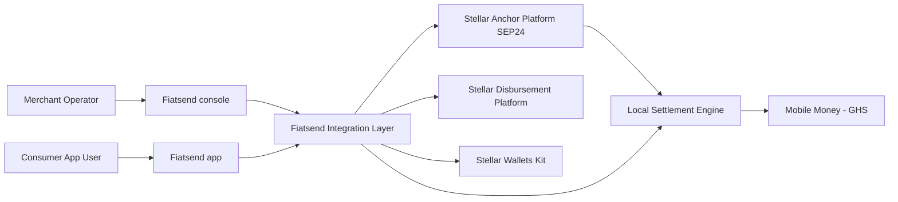

### 2.1 Business Treasury and Liquidity Flows

Merchants interact with Stellar liquidity through the console using Wallets Kit and MoneyGram (SEP-24). These flows are distinct from consumer-to-merchant QR payments and from GHS mobile-money payouts.

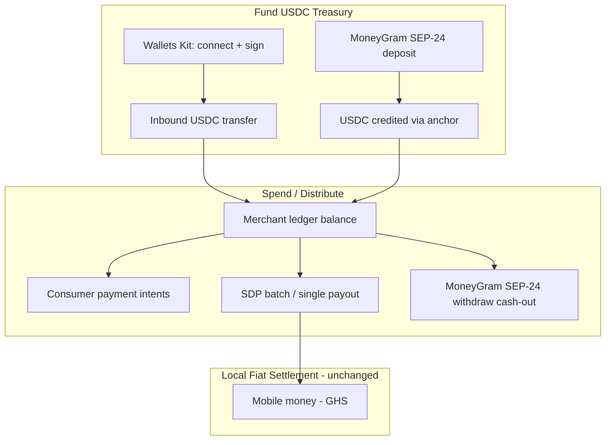

| Flow | Entry point | Stellar component | Ledger impact |
|------|-------------|-------------------|---------------|
| Fund via wallet | Console → Wallets Kit | On-chain USDC transfer to bound account | Credit `available_usdc` after chain finality |
| Cash-in (deposit) | Console → SEP-24 interactive URL | MoneyGram anchor deposit | Credit after anchor `completed` + reconciliation |
| Cash-out (withdraw) | Console → SEP-24 withdraw | MoneyGram anchor withdraw | Debit after anchor confirms + chain leg final |
| Consumer payment | App QR / link | Horizon-verified payment tx | Credit merchant on `paid` |
| GHS payout | Partner API / console batch | SDP on-chain + local rail | Debit on `local_settled` only |

**Design invariant:** `onchain_complete` (chain or SDP) does **not** imply `local_settled` (mobile money delivered). Fiatsend's customer promise is fulfilled only at `local_settled` for GHS legs.

---

## 3) Integration Layer Architecture

The integration layer sits between Fiatsend product surfaces and Stellar ecosystem services. It provides:

- policy enforcement (KYB tiers, limits, route eligibility),
- idempotent orchestration and retries,
- status normalization across on-chain and off-chain states,
- auditable eventing for grant and compliance reporting.

### 3.1 New Module Structure

```text
fiatsend-app/
  src/lib/stellar/
    anchorPlatformClient.ts
    sep38Quotes.ts
    sdpClient.ts
    walletsKitAdapter.ts
    routing/
      ghsRoutePolicy.ts
      feePolicy.ts
    events/
      stellarEventNormalizer.ts
      webhookSignature.ts
```

---

## 4) Stellar Anchor Platform Integration - SEP-24 Conversion and Settlement

### 4.1 What the Anchor Platform Layer Does in Fiatsend

The Anchor Platform integration layer connects Fiatsend to **MoneyGram** via SEP-24 for merchant **cash-in** (deposit) and **cash-out** (withdraw), plus transfer lifecycle tracking. In Fiatsend, this is the regulated bridge between fiat cash corridors and USDC treasury balances.

For **GHS mobile-money payouts** to end recipients, Fiatsend continues to use its local settlement engine after the on-chain leg completes (see §19.1.2). SEP-24 MoneyGram flows and GHS payout flows must not share a single conflated status field.

### 4.2 Off-Ramp Payment Flow

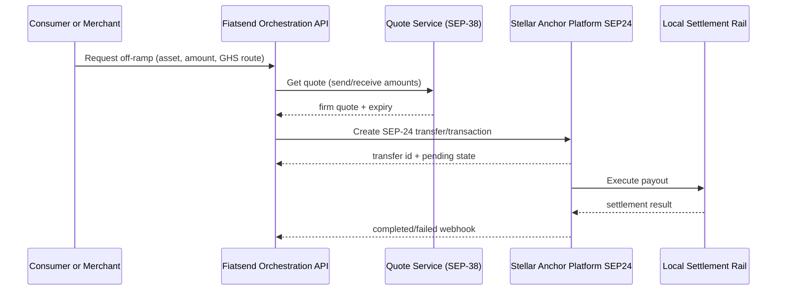

### 4.3 Anchor Platform Integration Points

- Quote acquisition and verification (`SEP-38`).
- Transfer initiation and status tracking (`SEP-24 transfer endpoints`).
- Webhook callback processing and status reconciliation in `fiatsend-functions`.
- GHS route compliance and payout rule validation before anchor submission.

### 4.4 Ghana Corridor Routing (GHS)

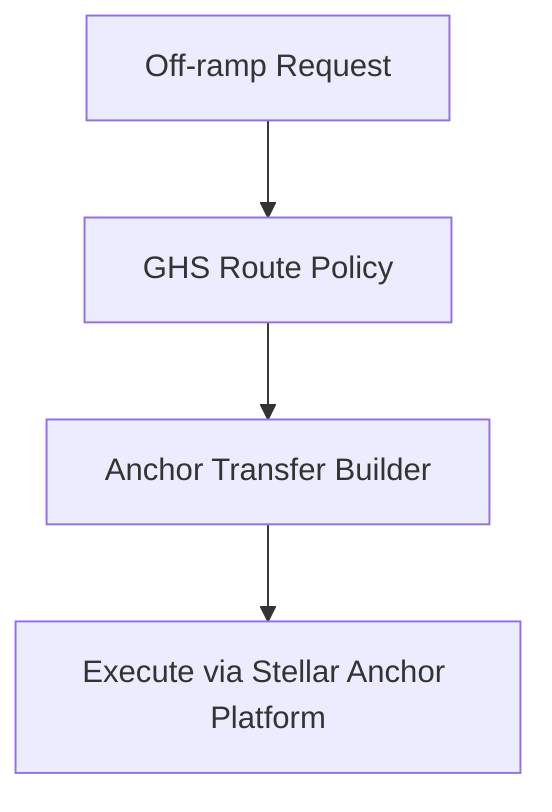

Corridor strategy: Fiatsend integrates with a GHS-capable anchor provider for USDC - GHS settlement (Yellow Card / Seevcash), with provider routing and failover managed by Fiatsend policies.

### 4.5 SEP-38 Quote Flow

- Fiatsend fetches executable quote with strict TTL.
- Quote hash and expiry are persisted for replay protection.
- Converted amount, fee, and spread are pinned to ledger entry before payout creation.
- If quote expires before transfer submit, flow restarts with new quote.

### 4.6 MoneyGram Merchant Cash-In and Cash-Out

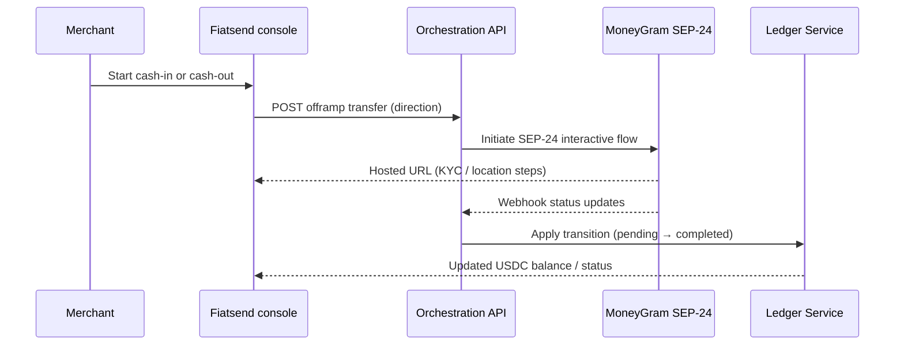

- **Cash-in (deposit):** Merchant completes MoneyGram SEP-24 deposit; ledger credits USDC on anchor `completed` after reconciliation.
- **Cash-out (withdraw):** Merchant debits USDC treasury; MoneyGram SEP-24 withdraw completes; ledger debits on confirmed withdraw.
- Cash-in/cash-out statuses are tracked on `offramp_transfers`, separate from `payout_item` GHS settlement.

---

## 5) Stellar Disbursement Platform (SDP) - Batch Payouts

### 5.1 What SDP Does in Fiatsend

SDP orchestrates large-volume payout execution and lifecycle tracking, while Fiatsend retains recipient governance, compliance policy, and local settlement confirmation.

### 5.2 Batch Payout Flow


### 5.3 SDP Integration Points

- Batch create and item mapping.
- Lifecycle polling and callback ingestion.
- Idempotent re-submission protections.
- DLQ handling for failed provider interactions.

### 5.4 SDP Batch Processing Pipeline

- `received` -> `validated` -> `submitted_to_sdp` -> `onchain_pending` -> `onchain_complete` -> `local_settled`.
- Failed records move to `manual_review_required` with retry metadata.

### 5.5 SDP Operational Controls

Production SDP/batch payout operations require explicit controls beyond the state machine:

| Control | Policy |
|---------|--------|
| Per-partner limits | Max items per batch, daily volume cap, and per-recipient amount ceiling by KYB tier |
| Batch approval | Batches above tier threshold require `pending_approval` → operator or dual-control `approved` before SDP submit |
| Partial batch failure | Batch status = `partially_complete`; failed items isolated; successful items continue to local settlement |
| Retry limits | Max 3 automated retries per item with exponential backoff; then `manual_review_required` |
| Manual override | Ops can force `local_settled` or `local_failed` only via dual-control with immutable audit reason |
| SLA alerts | Alert if item in `onchain_pending` > 15 min, `local_settlement_pending` > 30 min, or batch incomplete > 4 h |

---

## 6) Stellar Wallets Kit - Non-Custodial Wallet Connect

### 6.1 What Wallets Kit Does in Fiatsend

Wallets Kit provides merchant-controlled non-custodial wallet connectivity for account linking, balance visibility, payment authorization, and **direct USDC funding** of the merchant treasury (signed transfer from the connected wallet to the business-bound Stellar account).

### 6.2 Wallet Payment Flow

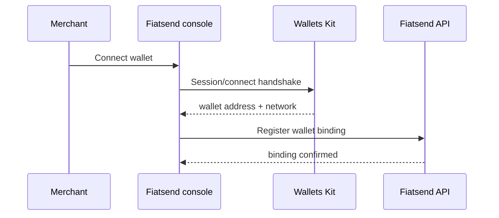

### 6.3 SDK Integration

- Client SDK in `Fiatsend console` for connect/disconnect/sign interactions.
- Signed payload verification in backend prior to persisting wallet bindings.
- Network capability checks (testnet/mainnet gates by partner tier).

### 6.4 Wallets Kit Integration Points

- Wallet binding management
- Payment authorization UX
- Signature verification APIs
- Account capability registry

---

## 7) Unified Data Model

Fiatsend uses a unified model across wallet bindings, quote snapshots, payout batches, item-level statuses, and settlement outcomes.

### 7.1 New Database Schema Additions

- `stellar_wallet_bindings`
- `offramp_quotes`
- `offramp_transfers`
- `sdp_batches`
- `sdp_batch_items`
- `ghs_route_policies`

---

## 8) API Endpoints (Aligned to Repositories)

Fiatsend exposes three API surfaces. Paths below are **exact** for shipped code; Stellar extensions are **proposed** and namespaced to match each repo's conventions.

| Surface | Base URL (production) | Auth | Repository |
|---------|----------------------|------|------------|
| Partner API | `https://api.fiatsend.com/v1` | `Authorization: Bearer fs_live_*` | `fiatsend-partner-api` |
| Partner API (sandbox) | `https://sandbox.fiatsend.com/v1` | `Authorization: Bearer fs_test_*` | `fiatsend-partner-api` |
| Console BFF | `https://console.fiatsend.com/api` | Session cookie / bearer from login | `fiatsend-console` |
| Provider webhooks | Cloud Functions URL (per env) | HMAC / provider JWT | `fiatsend-functions` |

Response envelope (Partner API): `{ "status": "success" \| "error", "data": ..., "code"?: ... }`.

### 8.1 Partner API (`fiatsend-partner-api`) — Shipped

Mounted at `/v1` in `src/index.ts`. Implements GHS payout and merchant collect flows; maps to ledger `payout_item` / `payment_intent` (§16.1).

#### Health and quoting

| Method | Path | Auth | Description |
|--------|------|------|-------------|
| `GET` | `/v1/health` | No | API health and environment |
| `GET` | `/v1/rates` | Bearer | FX quote (`from_currency`, `to_currency`, `amount`) |
| `GET` | `/v1/supported-networks` | Bearer | Mobile-money networks (MTN, TELECEL, AIRTELTIGO) |
| `GET` | `/v1/limits` | Bearer | KYB tier limits |

#### Withdrawals (GHS mobile-money payout)

| Method | Path | Auth | Idempotency | Description |
|--------|------|------|-------------|-------------|
| `POST` | `/v1/withdrawals` | Bearer | `reference_id` (body) | Create payout; `201` new, `200` duplicate ref |
| `GET` | `/v1/withdrawals/:id` | Bearer | — | Payout status; may include `on_chain_tx_hash`, `mobile_money_reference` |

**Body (`POST /v1/withdrawals`):** `amount`, `currency` (`USDC` \| `USDT`), `recipient_phone` (`+233…`), `mobile_network`, `reference_id`, optional `metadata`.

**Statuses:** `pending` → `processing` → `completed` \| `failed`.

**Webhook events:** `withdrawal.pending`, `withdrawal.processing`, `withdrawal.completed`, `withdrawal.failed`.

#### Payment intents (merchant collect / consumer approval)

| Method | Path | Auth | Idempotency | Description |
|--------|------|------|-------------|-------------|
| `POST` | `/v1/payment-intents` | Bearer | `merchant_reference` (body) | Create intent (`pending_approval`); `201` / `200` |
| `GET` | `/v1/payment-intents/:id` | Bearer | — | Get intent (auto-expires past TTL) |
| `POST` | `/v1/payment-intents/:id/cancel` | Bearer | — | Cancel while `pending_approval` |

**Body (`POST /v1/payment-intents`):** `amount`, `currency` (`GHS` \| `USDC` \| `USDT`), `consumer_phone`, `merchant_reference`, optional `terminal_id`, `description`, `metadata`.

**Webhook events:** `payment_intent.pending_approval`, `.approved`, `.completed`, `.rejected`, `.cancelled`, `.expired`, `.failed`.

#### Internal (consumer app / workers — not for merchant API keys)

| Method | Path | Auth | Description |
|--------|------|------|-------------|
| `POST` | `/v1/internal/payment-intents/:id/decision` | `X-Internal-Token` | `approve` \| `complete` \| `reject` \| `fail` |
| `GET` | `/v1/internal/payment-intents/:id` | `X-Internal-Token` | Read intent |
| `GET` | `/v1/internal/payment-intents?consumer_phone=` | `X-Internal-Token` | List pending for phone |

#### Transactions list and webhooks

| Method | Path | Auth | Description |
|--------|------|------|-------------|
| `GET` | `/v1/transactions` | Bearer | Paginated withdrawal history (`page`, `per_page`, `status`) |
| `POST` | `/v1/webhooks` | Bearer | Register endpoint + event subscriptions |
| `GET` | `/v1/webhooks` | Bearer | List registrations (secret omitted) |
| `DELETE` | `/v1/webhooks/:id` | Bearer | Remove registration |
| `GET` | `/v1/webhook-deliveries` | Bearer | Delivery logs (`?event_id=` optional) |
| `GET` | `/v1/webhook-deliveries/:event_id` | Bearer | Logs for one event |

**Outbound webhook headers:** `X-Fiatsend-Signature`, `X-Fiatsend-Event`, `X-Fiatsend-Delivery` (see §21.4).

#### Stellar extensions on Partner API (proposed — post chain verification)

| Method | Path | Auth | Description |
|--------|------|------|-------------|
| `POST` | `/v1/payment-intents/:id/submissions` | Bearer or internal | Submit `tx_hash` for USDC collect; → `onchain_pending` |
| `GET` | `/v1/payment-intents/:id` | Bearer | Extend response: `chain_status`, `on_chain_tx_hash` |

> `POST /v1/withdrawals` path and payload **unchanged** for integrators; Stellar adds `chain_status` / `local_status` on GET when dual-leg settlement is live.

### 8.2 Console API (`fiatsend-console`) — Shipped

Session-authenticated BFF for the business dashboard. Console UI calls these routes; programmatic partners use §8.1.

#### Auth and partner profile

| Method | Path | Description |
|--------|------|-------------|
| `POST` | `/api/auth/register`, `/api/auth/login`, `/api/auth/login/2fa`, `/api/auth/logout` | Partner auth |
| `GET` | `/api/auth/me` | Current partner session |
| `PATCH` | `/api/partner/profile`, `/api/partner/security`, `/api/partner/password` | Profile and 2FA |
| `GET` | `/api/kyb/status`, `POST` | `/api/kyb/create-didit-session` | KYB |

#### Treasury, terminals, payouts (console-native today)

| Method | Path | Description |
|--------|------|-------------|
| `GET` | `/api/partner/dashboard` | Dashboard aggregates |
| `GET` / `PATCH` | `/api/partner/wallet` | Balances (`USDC`, `USDT`, `GHS`), accept-payments toggle |
| `GET` / `POST` / `DELETE` | `/api/partner/terminals` | Payment terminals / QR |
| `GET` | `/api/public/terminals/:terminalId` | Terminal lookup (consumer app) |
| `GET` / `PUT` | `/api/partner/settlement` | Settlement configuration |
| `POST` | `/api/partner/swap` | USDC/USDT → GHS balance (MVP) |
| `GET` | `/api/transactions` | Partner transaction list |
| `POST` | `/api/transactions/payout` | Console-initiated payout (maps to same ledger as `/v1/withdrawals`) |
| `GET` | `/api/transactions/:id` | Transaction detail |
| `GET` / `POST` / `DELETE` | `/api/webhooks` | Webhook CRUD (console-managed) |
| `GET` | `/api/keys` | API key management |

**Console → Partner API:** Payment intent snippets in the UI target `POST {PARTNER_API}/v1/payment-intents` (see `wallets.tsx`). Payouts in sandbox docs use `POST {PARTNER_API}/v1/withdrawals`.

### 8.3 Stellar Program Extensions (Proposed)

Hosted on **console server** for merchant UX in tranche 1; orchestration may later move to `Fiatsend app`. All writes go through Ledger Service (§15.5).

#### Wallets Kit (console BFF)

| Method | Path | Auth | Description |
|--------|------|------|-------------|
| `POST` | `/api/partner/stellar/wallets/bind` | Session | Register binding after Wallets Kit connect |
| `POST` | `/api/partner/stellar/wallets/verify-signature` | Session | Verify signed challenge |
| `GET` | `/api/partner/stellar/wallets` | Session | Active binding + network + capabilities |
| `POST` | `/api/partner/stellar/wallets/unbind` | Session | Rebind flow with audit |

#### MoneyGram SEP-24 (cash-in / cash-out)

| Method | Path | Auth | Description |
|--------|------|------|-------------|
| `POST` | `/api/partner/stellar/deposits` | Session | Start cash-in; returns SEP-24 interactive URL |
| `POST` | `/api/partner/stellar/withdrawals` | Session | Start cash-out (MoneyGram, not GHS payout) |
| `GET` | `/api/partner/stellar/transfers/:id` | Session | Anchor transfer status |
| `POST` | `/api/partner/stellar/quotes` | Session | SEP-38 quote (TTL pinned on ledger) |

> **Naming:** `/api/partner/stellar/withdrawals` = MoneyGram USDC cash-out. GHS mobile-money payout remains `POST /v1/withdrawals` (Partner API) or `POST /api/transactions/payout` (console).

#### SDP batch payouts (console BFF)

| Method | Path | Auth | Description |
|--------|------|------|-------------|
| `POST` | `/api/partner/stellar/payout-batches` | Session | Upload / create batch |
| `GET` | `/api/partner/stellar/payout-batches/:batchId` | Session | Batch + item statuses |
| `POST` | `/api/partner/stellar/payout-batches/:batchId/retry` | Session | Retry failed items (policy §5.5) |
| `POST` | `/api/partner/stellar/payout-batches/:batchId/approve` | Session | Dual-control approval when over limit |

#### Consumer QR payment (internal — `Fiatsend app` / functions)

| Method | Path | Auth | Description |
|--------|------|------|-------------|
| `GET` | `/api/public/payment-intents/:id` | Public / app token | Resolve QR payload for payer |
| `POST` | `/v1/internal/payment-intents/:id/submissions` | `X-Internal-Token` | Submit `tx_hash` after consumer signs (alternative to §8.1 extension) |

### 8.4 Inbound Provider Webhooks (`fiatsend-functions`)

Not exposed on Partner API. Workers verify signature, enqueue outbox, ack `200` after durable receipt.

| Source | Proposed path | Purpose |
|--------|---------------|---------|
| MoneyGram / Anchor Platform | `/webhooks/stellar/anchor` | SEP-24 transfer status |
| SDP | `/webhooks/stellar/sdp` | Disbursement item updates |
| Horizon / indexer | `/webhooks/stellar/chain` | Tx finality for payment intents |
| Didit (existing pattern) | `/api/webhooks/didit-kyb` | KYB (console server today) |

---


## 9) Security Architecture

- strict environment isolation (`testnet` vs `mainnet` secrets and routes),
- signed webhooks with replay protection (see §21.4),
- role-based and tier-based action gating,
- idempotency keys on all financial mutations,
- immutable event and audit trails for payout/payment state changes,
- production checklist in §22.3 (key rotation, secrets manager, dual-control).

---

## 10) Infrastructure and Deployment

- `Fiatsend console`: UI releases with feature flags by partner cohort.
- `Fiatsend app`: orchestration APIs for wallet, anchor platform, off-ramp, and SDP adapters.
- `fiatsend-functions`: callback and reconciliation workers, backoff retries, DLQ processors.
- staged rollout:
  - tranche 1: testnet wallet + payment intent,
  - tranche 2: testnet off-ramp + SDP batches,
  - tranche 3: guarded mainnet launch with GHS volume ramp-up.

---

## 11) Technology Stack Summary

- **Frontend**: React/TypeScript (`Fiatsend console`, `Fiatsend app`)
- **Backend orchestration**: Next.js API routes + Node services
- **Async processing**: Firebase Functions scheduled and webhook workers
- **Stellar integrations**: Wallets Kit, Stellar Anchor Platform (SEP-24), SEP-compliant off-ramp APIs, SDP
- **Data and audit**: existing Fiatsend DB + event/audit records + reconciliation jobs

---

## 12) Product + Platform Context (Current State)

Fiatsend already operates a dual surface:

- **Business surface (`Fiatsend console`)**
  - Partner onboarding/KYB progression (`pending -> verified -> active`)
  - Wallet balances (`USDC`, `USDT`, `GHS`)
  - Payment terminal management and transaction history
  - Single payout and settlement configuration

- **Consumer surface (`Fiatsend app`)**
  - User authentication and wallet/deposit flows
  - Merchant payment interactions
  - Ledger and transfer activity APIs

- **Async/function surface (`fiatsend-functions`)**
  - Webhooks and long-running blockchain/settlement jobs
  - Scheduled reconciliation/indexing patterns already in production use

The Stellar program should extend this architecture, not replace it.

---

## 13) Strategic Engineering Principles

1. **Event-driven reliability over synchronous coupling**
   - Frontends should never wait for chain finality; status must be asynchronous.
2. **Dual-ledger model**
   - Keep on-chain status and off-chain local-settlement status distinct (`onchain_complete` ≠ `local_settled`).
3. **Ledger-first writes**
   - Adapters propose; Ledger Service commits merchant-visible state.
4. **Idempotent orchestration**
   - Every payment/payout creation endpoint accepts idempotency keys (`reference_id`, `merchant_reference`).
5. **Progressive feature flags**
   - Gate by environment, partner tier, and transaction limits.
6. **Audit-ready by default**
   - Every status transition must include source, actor, and correlation IDs.

---

## 14) Target Architecture (High-Level)

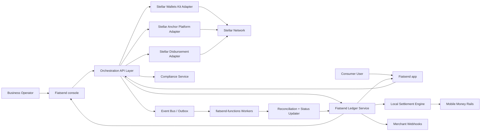

---

## 15) Component Ownership by Repository

### 15.1 `Fiatsend console` (Business UI + B2B API)

- Session BFF under `/api/partner/*` and `/api/transactions/*` (§8.2).
- Wallet connection UX using Stellar Wallets Kit (`/api/partner/stellar/wallets/*` proposed).
- Merchant wallet profile screen (address, network, trustline, balance).
- Payment link/QR via Partner API `POST /v1/payment-intents`; MoneyGram cash-in/out via `/api/partner/stellar/deposits|withdrawals` (proposed).
- SDP batch upload via `/api/partner/stellar/payout-batches` (proposed).
- Status dashboard:
  - `draft`, `queued`, `onchain_pending`, `onchain_complete`, `local_settled`, `failed`.

### 15.2 `Fiatsend app` (Core orchestration + consumer app APIs)

- Consumer payment intent resolution from QR/link (`GET /api/public/payment-intents/:id` proposed).
- Consumer approval and pay flow via Partner API internal routes (`/v1/internal/payment-intents/*`, §8.1).
- Ledger writes, settlement routing, and webhook dispatch (orchestration; may share console server in tranche 1).
- Shared auth/session and risk policy enforcement.

### 15.2a `fiatsend-partner-api` (External programmatic API)

- Shipped: `/v1/withdrawals`, `/v1/payment-intents`, `/v1/webhooks`, `/v1/transactions` (§8.1).
- Stellar extension: `/v1/payment-intents/:id/submissions` for on-chain collect verification.

### 15.3 `fiatsend-functions` (Async + integration edges)

- Webhook handlers (chain/disbursement/provider callbacks).
- Reconciliation workers and retry queues.
- Scheduled consistency checks for stale in-flight operations.

### 15.4 External dependencies

- Stellar Wallets Kit for merchant wallet session/connectivity.
- Stellar Anchor Platform (SEP-24) for hosted deposit/withdraw and transfer lifecycle.
- Stellar Disbursement Platform for disbursement job execution.
- Stellar network/Horizon/RPC for transaction visibility and confirmations.
- Existing local payout partners for fiat settlement.

### 15.5 Ledger Service (Canonical Source of Truth)

The **Fiatsend Ledger Service** is the single authoritative read model for all merchant-visible financial state. Stellar adapters, SDP, MoneyGram callbacks, and local settlement workers **propose** transitions; only the Ledger Service **commits** them.

**Owns (canonical):**

- Merchant balances (`USDC`, `USDT`, `GHS` views derived from ledger entries)
- Payment intent status (normalized lifecycle)
- Payout batch and item status (including dual leg: chain + local)
- Settlement references (`stellar_tx_hash`, `mobile_money_reference`, anchor transfer id)
- Immutable audit history and correlation IDs for every transition

**Does not own:**

- Raw Stellar Horizon responses (cached in `chain_tx` projection)
- External provider session state (MoneyGram SEP-24 interactive flow URLs)
- UI-only draft/upload validation state

**Write path:** Orchestration API / workers call `LedgerService.applyTransition(command)` with idempotency key. Adapters never write merchant balances directly.

**Read path:** Console, Partner API, and webhooks read **only** from Ledger projections (or materialized views fed by ledger events). Horizon/SDP/MoneyGram polling results update ledger via workers, not via direct API exposure.

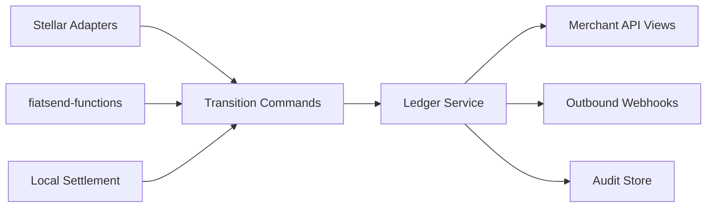

---

## 16) End-to-End Domain Model

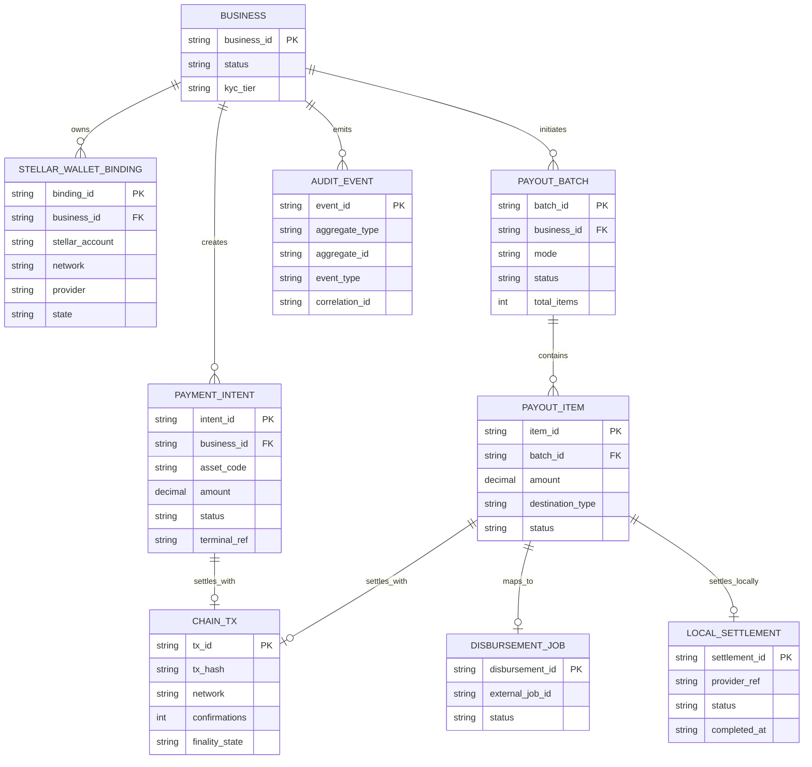

### 16.1 Production API to Stellar/Ledger Object Mapping

Fiatsend's live Partner API and console objects map into the Stellar program without breaking idempotency or webhook contracts. External field names stay stable; internal ledger aggregates gain Stellar-specific projections.

#### Withdrawals (Partner API `POST /withdrawals`)

| Production field | Ledger / Stellar aggregate | Notes |
|------------------|---------------------------|-------|
| `withdrawal_id` | `payout_item.item_id` (1:1) | Primary external ID preserved |
| `reference_id` | Idempotency key on `payout_item` + SDP external ref | Duplicate `reference_id` returns original item |
| `status` (`pending`, `processing`, `completed`, `failed`) | Normalized via payout item state machine | See mapping table below |
| `on_chain_tx_hash` | `chain_tx.tx_hash` | Set when SDP/chain leg completes |
| `mobile_money_reference` | `local_settlement.provider_ref` | Set only on `local_settled` |
| Webhook `withdrawal.*` | Emitted from ledger transition | Event payload keeps existing shape |

| Partner API `status` | Payout item (internal) | Chain leg | Local leg |
|----------------------|------------------------|-----------|-----------|
| `pending` | `queued` | — | — |
| `processing` | `onchain_pending` or `local_settlement_pending` | in flight | in flight |
| `completed` | `local_settled` | `onchain_complete` | success |
| `failed` | `onchain_failed` or `local_failed` | terminal | terminal |

#### Payment intents (Partner API + consumer QR flow)

| Production field | Stellar aggregate | Notes |
|------------------|-------------------|-------|
| `payment_intent_id` | `payment_intent.intent_id` | Unchanged |
| `merchant_reference` | Idempotency key + SEP memo / tx memo binding | Must match verified on-chain memo |
| `status` (approval workflow) | Ledger intent state + `chain_tx` projection | Stellar path adds `onchain_pending`, `paid` |
| Webhook `payment_intent.*` | Ledger-emitted | Approval events unchanged; `paid` adds `on_chain_tx_hash` in payload |

| Partner API `status` | Stellar payment intent (internal) |
|----------------------|-----------------------------------|
| `pending_approval` | `created` / `awaiting_payment` |
| `approved` | `awaiting_payment` (ready for chain pay) |
| `completed` | `paid` (+ chain tx verified) |
| `failed` / `rejected` / `cancelled` / `expired` | `failed` / `expired` |

#### SEP-24 MoneyGram transfers (new, console)

| Console action | Ledger aggregate | External ref |
|----------------|------------------|--------------|
| Cash-in (deposit) | `offramp_transfers` (direction=`deposit`) | MoneyGram `transfer_id` |
| Cash-out (withdraw) | `offramp_transfers` (direction=`withdraw`) | MoneyGram `transfer_id` |

#### Webhook and settlement status

- **Webhook event type** is derived from ledger transition name (e.g. `withdrawal.completed` only when `local_settled`).
- **Settlement status** exposed to merchants is always the ledger-normalized status, never raw SDP or anchor enum values.
- **Dual status in API responses:** optional `chain_status` and `local_status` fields for integrators that need both legs; top-level `status` remains the merchant promise field (`local_settled` → `completed` for withdrawals).

---

## 17) Wallets Kit Integration Architecture

### 17.1 Wallet Binding Flow

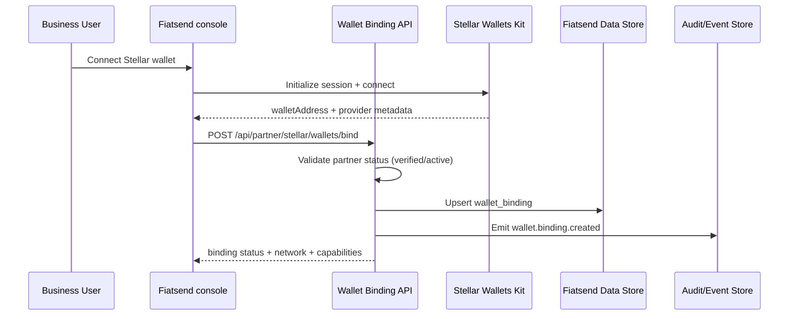

### 17.2 Guardrails

- One active wallet binding per business/environment by default.
- Require explicit rebind flow with cooldown and audit trail.
- Store provider/session metadata only; never persist wallet private keys.
- Enforce allowlist by network (`testnet`, `mainnet`) and supported assets.

---

## 18) Merchant Payment Flow Architecture (Consumer -> Business)

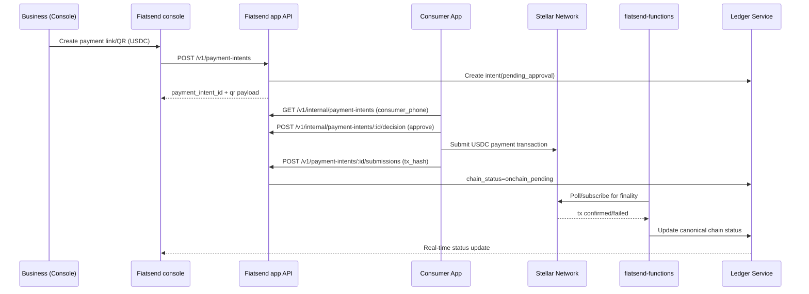

### 18.1 Payment intent API contract (aligned)

Uses **Partner API** paths (§8.1). Console and consumer app are clients; Ledger Service owns committed state.

**Create (merchant / console / server-side integration)**

- `POST /v1/payment-intents` (Bearer `fs_*`)
  - Input: `amount`, `currency`, `consumer_phone`, `merchant_reference`, optional `terminal_id`, `description`, `metadata`
  - Output: `payment_intent_id`, `status` (`pending_approval`), `expires_at`, …
  - Idempotency: same `merchant_reference` → `200` with original intent

**Consumer approval (internal)**

- `POST /v1/internal/payment-intents/:id/decision`
  - Header: `X-Internal-Token`
  - Body: `{ "decision": "approve" | "complete" | "reject" | "fail", "reason"?: string }`
  - Emits `payment_intent.approved` / `.completed` / etc.

**Stellar payment submission (proposed extension)**

- `POST /v1/payment-intents/:id/submissions`
  - Input: `tx_hash`, `wallet_address`, optional `client_timestamp`
  - Output: `chain_status`: `onchain_pending`
  - Worker verifies per §18.2; ledger moves to `paid`; webhook `payment_intent.completed` includes `on_chain_tx_hash`

**Read**

- `GET /v1/payment-intents/:id`
  - Shipped: approval workflow fields
  - Proposed additions: `chain_status`, `on_chain_tx_hash`, `local_status` (when applicable)

**QR / public resolve (proposed)**

- `GET /api/public/payment-intents/:id` on console or app — returns payee address, amount, asset, memo encoding for Wallets Kit / wallet app

### 18.2 On-Chain Transaction Verification (Payment Intents)

Before any payment intent moves to `paid`, the verification worker must validate the submitted `txHash` against the intent record and merchant binding. **No field is optional for production.**

| Check | Requirement |
|-------|-------------|
| Network | Matches intent environment (`testnet` / `mainnet`) |
| Finality | Meets configured confirmation threshold (e.g. ≥ 1 ledgers closed on target network) |
| Destination | Credit account = merchant `stellar_wallet_bindings.stellar_account` for `business_id` |
| Asset code | Matches `payment_intent.asset_code` (e.g. `USDC`) |
| Issuer | Matches Fiatsend allowlisted issuer for asset + network |
| Amount | `>=` intent amount (overpay allowed; underpay rejects) |
| Memo / reference | Matches `intent_id` or configured `merchant_reference` encoding |
| Business binding | Tx must not credit a wallet bound to a different `business_id` |
| Replay | Same `tx_hash` cannot satisfy two intents |
| Failure modes | Failed/expired chain tx → `failed`; do not emit `payment_intent.completed` webhook |

Verification runs in `fiatsend-functions` (poll/subscribe); results are applied via `LedgerService.applyTransition` only.

---

## 19) SDP Payout Architecture (Business -> Recipient)

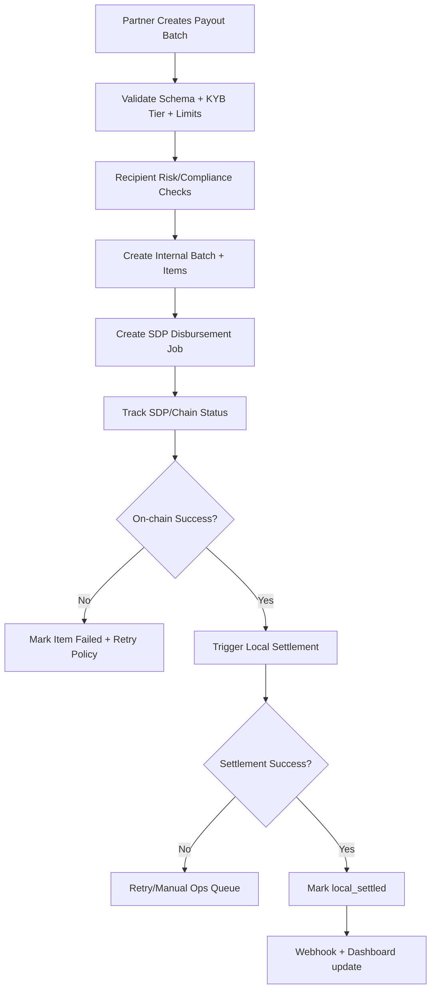

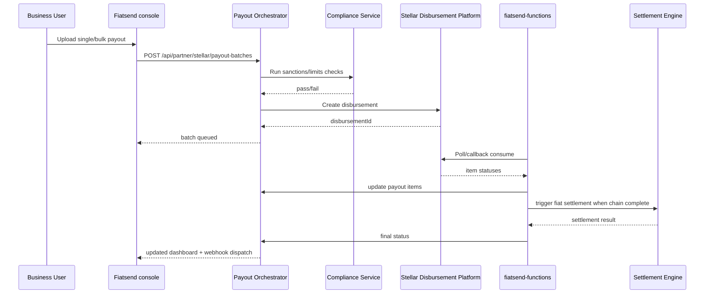

### 19.1 SDP Deployment Model and Anchor Strategy

This section defines the operational model for SEP-24 + SDP and how local-currency settlement is closed in Fiatsend's ledger.

### 19.1.1 Deployment model

- **Self-hosted SDP stack by Fiatsend** in a Fiatsend-managed cloud environment (separate testnet and mainnet deployments).
- **Rationale**:
  - direct control over KYC/compliance integrations and webhook security boundaries,
  - operational control for payout retry/reconciliation workers,
  - reduced dependency risk during milestone execution.
- **Hosted SDP option** remains a future optimization, but is not assumed in SCF43 critical path.

### 19.1.2 Anchor strategy for local-currency settlement leg

Fiatsend acts as the business integration layer to **MoneyGram** as the regulated anchor/off-ramp provider exposing SEP-24 deposit (cash-in), withdraw (cash-out), and transfer lifecycle APIs.

- **On-chain leg**: Stellar asset movement and transaction finality are tracked via SDP and chain observers.
- **Off-chain local-currency leg**: once payout state reaches `onchain_complete`, Fiatsend triggers mobile-money settlement through its local payout partners.
- **Status model**: Fiatsend keeps on-chain and local settlement statuses distinct (`onchain_complete` is not equal to `local_settled`).

### 19.1.3 Reconciliation close process (on-chain -> mobile money)

Fiatsend closes reconciliation using a dual-reference approach:

1. persist `stellar_tx_hash` / disbursement reference from SDP,
2. persist `local_provider_ref` from mobile-money rail,
3. correlate both under one internal payout item ID and immutable audit event chain.

Closure rules:

- Move to `local_settled` only when:
  - on-chain state is final/complete, and
  - local settlement provider confirms success.
- Keep `local_settlement_pending` if only one side is complete.
- Move to `local_failed` and manual operations queue on timeout/terminal provider failure.
- Run scheduled reconciliation to detect drift between:
  - SDP/chain-complete records and
  - local provider settlement confirmations.

### 19.1.4 Operational ownership and capacity

- `fiatsend-app`: API orchestration, idempotency, and payout state transitions.
- `fiatsend-functions`: webhook ingestion, retries, dead-letter processing, and scheduled reconciliation.
- Operations/compliance: exception queue handling and settlement break resolution.

No smart-contract engineering capacity is required for SCF43 delivery under this model.

---

## 20) State Machines (Canonical)

### 20.1 Payment Intent

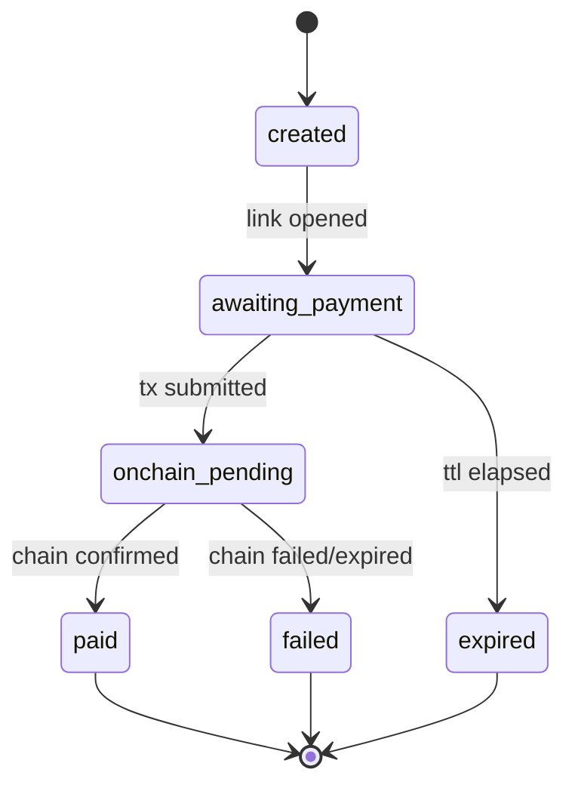

### 20.2 Payout Item

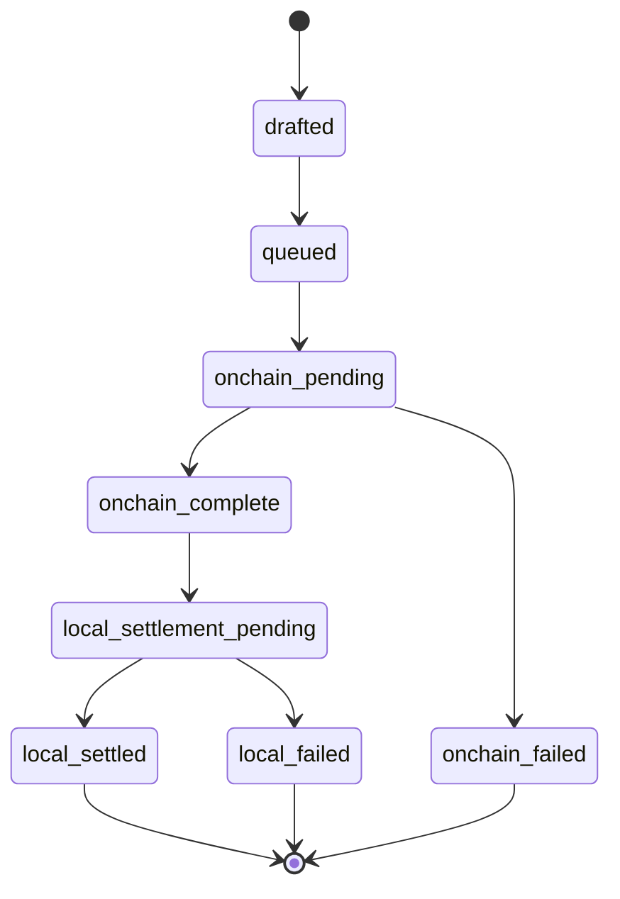

---

## 21) Reliability, Retry, and Reconciliation

### 21.1 Outbox + worker model

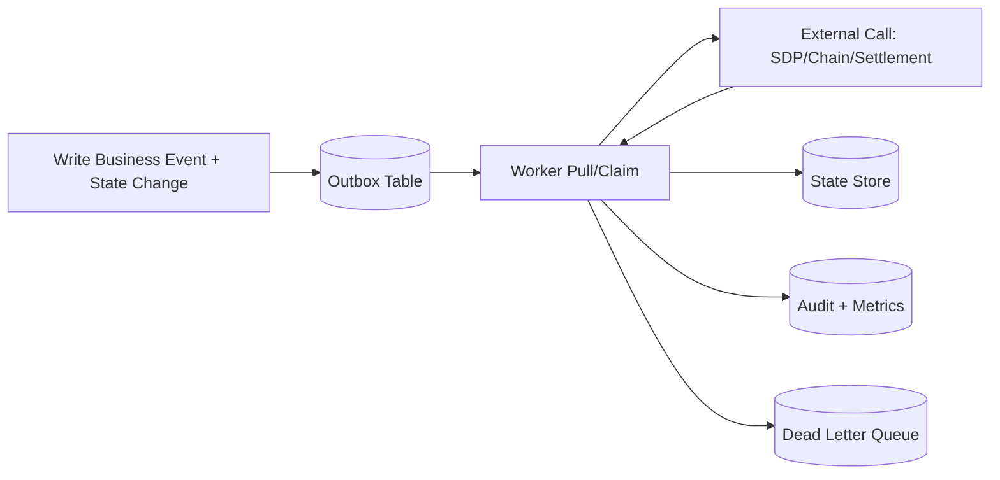

### 21.2 Policy

- Exponential retry with jitter for transient network/provider failures.
- Hard failure thresholds route items into manual operations queue.
- Scheduled reconciliation compares:
  - internal `onchain_pending` records vs chain confirmations
  - internal `local_settlement_pending` vs provider settlement status
- Idempotency keys on all create/mutate endpoints and worker handlers.

### 21.3 Stuck-State Matrix and Recovery

Fast settlement and webhook SLAs require explicit handling when chain, anchor, or local rails diverge. All recovery actions write through the Ledger Service and emit audit events.

| Stuck state | Detection | Automated action | Manual / ops |
|-------------|-----------|------------------|--------------|
| Pending chain tx | `onchain_pending` > SLA; Horizon shows no tx | Re-poll Horizon; if tx missing, reject submission and notify payer | Reconcile against wallet/explorer; reopen intent if valid late tx |
| Chain success, local payout failed | `onchain_complete` + `local_failed` | Retry local settlement (max 3); alert ops | Dual-control: retry, refund on-chain credit, or mark `local_settled` with evidence |
| Delayed provider callback | Internal ahead/behind provider status | Scheduled reconciliation job compares provider API vs ledger | Force status sync from provider authoritative record |
| Duplicate webhook / callback | Same `event_id` or provider ref seen twice | Idempotent handler: no-op if transition already applied | Investigate if amounts differ |
| Duplicate tx hash claim | Second intent submits same hash | Reject second submission | Link to original intent |
| Anchor (MoneyGram) complete, ledger not updated | SEP-24 `completed` in provider, ledger stale | Worker applies credit/debit from provider poll | Manual ledger adjustment with ticket + audit |
| Batch partially stuck | Mixed item terminal states | Continue successful items; isolate failures | Export failed rows; re-submit as new batch with new `reference_id`s |

**Reconciliation cadence:** near-real-time workers for in-flight items; nightly ledger vs chain vs mobile-money vs MoneyGram transfer close.

**Runbooks (required before mainnet):** chain-pending timeout, chain-complete/local-failed, webhook storm/duplicate delivery, manual settlement override, batch partial failure export.

### 21.4 Webhook Delivery Contract (Outbound + Inbound)

#### Outbound (Fiatsend → merchant endpoints)

Aligned with production Partner API behavior; Stellar program extends the same contract.

| Mechanism | Specification |
|-----------|----------------|
| Signature | `HMAC-SHA256` over raw JSON body; header `X-Fiatsend-Signature: sha256=<hex>` |
| Event identity | `event.id` (unique per emission); header `X-Fiatsend-Delivery` per attempt |
| Event type | Header `X-Fiatsend-Event`; body `type` must match |
| Timestamp | `created_at` ISO 8601 in body; receivers should reject if \|now − created_at\| > **5 minutes** |
| Replay protection | Merchants should store processed `event.id` for 7 days; duplicates return `200` without side effects |
| Retry policy | Up to **3** attempts; backoff **1 s, 4 s, 16 s**; 10 s HTTP timeout |
| Ordering | Not guaranteed across events; merchants use `created_at` + `event.id` for ordering; state machine is source of truth |
| Idempotent emission | Same ledger transition must not emit two distinct success events for the same aggregate |

#### Inbound (SDP / MoneyGram / chain observers → Fiatsend)

| Mechanism | Specification |
|-----------|----------------|
| Signature verification | Provider-specific HMAC or JWT per integration guide |
| Timestamp window | Reject callbacks outside **5 minute** skew |
| Nonce / replay | Store provider `event_id` or `(transfer_id, status)` tuple; duplicates ack `200` no-op |
| Processing | Async: ack quickly, enqueue to outbox, worker applies ledger transition |
| Failure | Return `5xx` only when enqueue fails; otherwise `200` after durable receipt |

---

## 22) Security and Compliance Architecture

### 22.1 Security controls

- **AuthN/AuthZ**: partner role + status gates already used in console APIs.
- **Data protection**:
  - encrypt recipient destination identifiers at rest.
  - redact PII in logs; store only masked variants in event streams.
- **Webhook authenticity**: see §21.4 (HMAC, timestamp window, replay/nonces, retry and duplicate handling).
- **Secrets management**: provider and webhook secrets in a secrets manager (not env files in production); testnet/mainnet segregation; automated rotation schedule.
- **Least privilege**: service accounts per adapter (Horizon read, SDP submit, anchor callback) with minimal IAM scopes.
- **Operational security**: 2FA mandatory for console operators; dual-control for payout overrides and manual ledger adjustments.
- **PII**: encrypt recipient phone/identifiers at rest; redact in logs and metrics; masked values only in event streams.

### 22.2 Compliance controls

- KYB level gates max payout amount, batch size, and daily velocity.
- Rule-engine decision records persisted with rule version metadata.
- Manual override requires dual-control and immutable audit event.

### 22.3 Production Security and Compliance Checklist

| Area | Production requirement |
|------|------------------------|
| Key rotation | Webhook signing secrets and API keys rotated on schedule; zero-downtime dual-secret window |
| Secrets | GCP/AWS secrets manager (or equivalent); no secrets in repo or plaintext CI vars |
| IAM | Least-privilege roles per service; break-glass accounts audited |
| Operators | 2FA on all production console access; separate ops vs finance roles |
| PII | Field-level encryption for destination identifiers; log redaction enforced in workers |
| Sensitive overrides | Manual `local_settled` / balance adjustment requires two approvers + ticket id in audit |
| Environments | Hard separation of testnet/mainnet data, bindings, and webhook endpoints |

---

## 23) Observability and Operational Excellence

### 23.1 Telemetry standards

- Correlation IDs propagated from UI request -> orchestration -> worker -> external provider.
- Structured events by domain:
  - `wallet.binding.*`
  - `payment.intent.*`
  - `payout.batch.*`, `payout.item.*`
  - `settlement.*`

### 23.2 Key SLOs

- Payment finalization p95 (intent submission -> final state) <= 2 minutes.
- Payout status freshness p95 (external update -> console visible) <= 30 seconds.
- Reconciliation drift < 0.1% of daily volume.
- Webhook delivery success >= 99.5% (with retries).

---

## 24) Environment and Release Strategy


### 24.1 Tranche delivery mapping

- **Tranche 1 (MVP)**
  - Wallets Kit connect flow in console.
  - Merchant payment links/QR generated with Stellar metadata.
  - End-to-end demo from console to consumer payment.

- **Tranche 2 (Testnet)**
  - SDP integration for single + batch payout.
  - Reconciliation workers and payout state machine in testnet.
  - Batch test >= 20 recipients with visible status tracking.

- **Tranche 3 (Mainnet)**
  - Production rollout with guardrailed partner cohort.
  - Local settlement orchestration with operational runbooks.
  - Live transactions and measured business adoption targets.

---

## 25) Engineering Work Breakdown (Implementation Plan)

### Stream A: Wallets + Merchant Payments

1. Add wallet binding schema + migration.
2. Build Wallets Kit adapter and provider abstraction.
3. Add payment intent APIs and QR payload signing.
4. Add worker-based chain confirmation service.
5. Add payment status webhooks and dashboard feed.

### Stream B: SDP Payouts

1. Add payout batch/item/disbursement tables.
2. Build SDP adapter with strict idempotency.
3. Add compliance pre-check service integration.
4. Add local settlement trigger pipeline from on-chain completion.
5. Add reconciliation jobs + manual operations tooling.

### Stream C: Platform Readiness

1. Feature flags, partner gating, and limits config.
2. Telemetry dashboards + alerting + SLA alarms.
3. Incident playbooks and on-call handoff docs.
4. Security review, key rotation, and webhook signature hardening.

---

## 26) Risk Register

| Risk | Impact | Mitigation |
|---|---|---|
| On-chain confirmation delays | Status staleness and user confusion | Async state model + clear ETA + reconciliation pollers |
| External API instability (SDP/local rails) | Payout failures or duplicate attempts | Idempotency keys, retries with jitter, DLQ and manual queue |
| Data inconsistency across services | Financial/audit risk | Dual-write prevention, outbox pattern, nightly ledger reconciliation |
| Compliance false positives | Legitimate payout friction | Rule versioning + human review + override audit controls |
| Mainnet launch regression | Business interruption | Canary rollout by partner cohort + rollback flags |

---

## 27) Decision Log (Initial ADRs)

1. **ADR-001: Async-first orchestration**
   - Use worker-driven finalization; API requests return accepted state quickly.
2. **ADR-002: Dual-status payout model**
   - Separate `onchain_complete` from `local_settled`.
3. **ADR-003: Environment isolation**
   - Hard boundary between testnet and mainnet credentials, bindings, and limits.
4. **ADR-004: Canonical ledger events**
   - All final business state transitions must emit immutable audit events.

---

## 28) Success Criteria

### 28.1 Technical

- >= 99% successful payment intent finalization in pilot cohort.
- >= 98% payout batch item completion excluding external rail downtime windows.
- <= 0.1% reconciliation variance on daily close.

### 28.2 Product/Business (aligned to SCF trajectory)

- At least 25 businesses with active mainnet Stellar wallet bindings.
- At least 100 real production payment/payout transactions.
- At least 1 successful batch payout ($5k min) using Stellar rails with visible local settlement completion.

---

## 29) Conclusion

This architecture extends Fiatsend's production payout platform with Stellar Wallets Kit (USDC funding + payments), MoneyGram SEP-24 (cash-in/cash-out), SDP (batch disbursement), and on-chain verification—while keeping GHS mobile-money settlement on existing rails.

**Core commitments:**

1. **Dual-ledger discipline** — `onchain_complete` ≠ `local_settled`; merchant-facing `completed` means local delivery where applicable.
2. **Ledger Service as source of truth** — all balances, statuses, webhooks, and audit history commit through one service.
3. **Stable production API boundary** — `withdrawal`, `payment_intent`, `reference_id`, and webhook shapes map cleanly to internal Stellar aggregates (§16.1).
4. **Operational rigor** — stuck-state matrix, webhook contract (§21.3–21.4), tx verification (§18.2), SDP controls (§5.5), and pre-mainnet runbooks.

The design is suitable for Fiatsend's current product direction. Priority before mainnet: tighten the integration boundary between the live Partner API and new Stellar components—especially ledger writes, state transitions, webhook reliability, reconciliation jobs, and operator runbooks.

---

## Appendix A) Architecture Review Notes (May 2026)

External review (Austin) confirmed directional fit and recommended the tightenings incorporated above:

- Preserve local settlement rails alongside Stellar components.
- Make `onchain_complete` vs `local_settled` separation explicit (customer promise = mobile money delivery).
- Map production API objects to ledger/Stellar state machines.
- Strengthen stuck-state handling, webhook security, payment tx verification, SDP ops controls, and production security checklist.
- Document Ledger Service as canonical source of truth for merchant-visible state.
