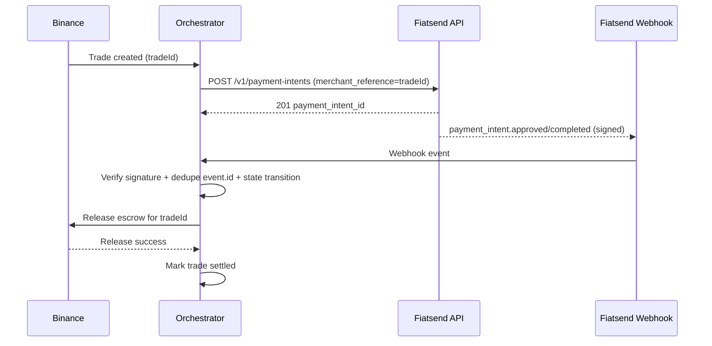
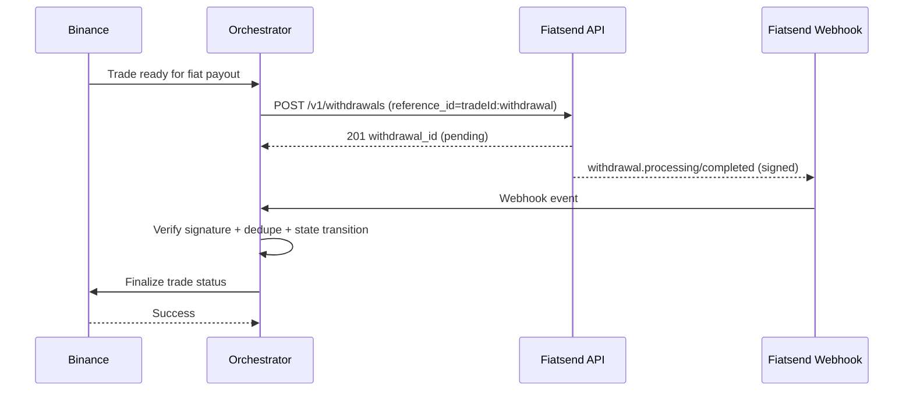

# Binance P2P x Fiatsend Technical PRD

## Document Control

- Product: Fiatsend Partner API
- Feature: Binance P2P settlement orchestration (GHS rails)
- Version: 1.0
- Status: Draft for implementation
- Owner: Partnerships + Engineering

## 1) Problem Statement

In Ghana P2P trading, payment confirmation and settlement often depend on sellers being online. This creates delays and poor user experience, especially during urgent transactions.

We need an integration model where:

- buyer payment confirmation is automated and trusted
- seller offline status does not block trade completion
- payout and release actions are driven by verified events
- duplicate or out-of-order events do not cause double actions

## 2) Goals and Non-Goals

### Goals

- Automate buyer payment confirmation using Fiatsend payment intents.
- Automate buyer payout completion using Fiatsend withdrawals.
- Enable deterministic Binance trade actions from verified Fiatsend webhooks.
- Provide full idempotency and event deduplication.
- Ship a production-ready MVP in 2 weeks.

### Non-Goals

- Building or replacing Binance's core escrow engine.
- Exposing partner API keys in mobile/web clients.
- Supporting non-Ghana rails in v1.
- Building a full dispute management UI in v1.

## 3) Success Metrics

Primary:

- >= 95% of eligible trades complete without manual seller confirmation.
- Median time from buyer action to Binance state update <= 10 seconds.
- 0 duplicate Binance release operations caused by retries/webhook redelivery.

Secondary:

- Webhook verification failure rate < 0.1%.
- Trade state stuck rate (no transition > 5 minutes) < 0.5%.
- Failed payout auto-recovery (retry/manual queue) > 90% within SLA.

## 4) Personas and Core Use Cases

- Ghanaian P2P Seller: wants trades to complete even when offline.
- Buyer: wants immediate, trusted payment acknowledgment and completion.
- Exchange Ops: wants auditability, fewer support tickets, fewer stuck trades.

Use cases:

1. Buyer pays seller in GHS, seller offline, USDT still released safely.
2. Seller sells USDT, buyer receives GHS wallet credit after successful settlement.
3. Duplicate webhook/event delivery does not duplicate Binance actions.
4. Failed payout transitions trade to recoverable/visible failure state.

## 5) System Architecture

Components:

- Binance P2P API (trade lifecycle and escrow actions)
- Fiatsend Partner API (`payment-intents`, `withdrawals`, `webhooks`)
- Orchestrator Service (new service owned by Fiatsend integration team)
- State Store (trade mapping, idempotency ledger, event log)
- Queue/Worker (async webhook processing, retries, reconciliation)
- Monitoring/Alerting (stuck states, failures, SLOs)

Principles:

- All command side-effects are server-side only.
- Webhook ingress is lightweight and asynchronous.
- State transitions are explicit and validated.
- Commands are idempotent and replay-safe.

## 6) End-to-End Flows

### 6.1 Buyer Pays Seller in GHS (Auto-confirm flow)



### 6.2 Seller Sells USDT, Buyer Gets GHS (Auto-payout flow)



## 7) State Machine

Allowed states:

- `TRADE_CREATED`
- `PAYMENT_INTENT_CREATED`
- `PAYMENT_PENDING_APPROVAL`
- `PAYMENT_APPROVED`
- `PAYMENT_COMPLETED`
- `BINANCE_RELEASE_REQUESTED`
- `BINANCE_RELEASED`
- `WITHDRAWAL_CREATED`
- `WITHDRAWAL_PROCESSING`
- `WITHDRAWAL_COMPLETED`
- `FAILED`
- `CANCELLED`
- `DISPUTE`

Transition rules:

- No backward transitions without compensating action.
- Terminal states: `WITHDRAWAL_COMPLETED`, `FAILED`, `CANCELLED`, `DISPUTE`.
- Any command retry must evaluate current state before side effects.

## 8) API Contracts (Orchestrator Internal)

### 8.1 Start Trade Automation

- Method: `POST /internal/binance-p2p/trades`
- Purpose: create orchestration context from Binance trade event
- Idempotency key: `trade_id`

Request:

```json
{
  "trade_id": "123456789",
  "flow": "buyer_pays_seller",
  "buyer_phone": "+233501234567",
  "seller_phone": "+233209876543",
  "amount": "100.00",
  "currency": "USDT",
  "network": "MTN"
}
```

Response:

```json
{
  "status": "accepted",
  "trade_id": "123456789",
  "state": "PAYMENT_INTENT_CREATED"
}
```

### 8.2 Fiatsend Webhook Ingress

- Method: `POST /internal/webhooks/fiatsend`
- Behavior:
  - verify `X-Fiatsend-Signature` on raw body
  - reject 401 on invalid signature
  - dedupe by `event.id`
  - enqueue processing and return 200 quickly

### 8.3 Reconciliation Job Trigger (Manual)

- Method: `POST /internal/binance-p2p/reconcile`
- Purpose: recover stuck trades by re-checking Fiatsend/Binance states

## 9) Fiatsend API Usage Requirements

Payment intents:

- `POST /v1/payment-intents`
  - set `merchant_reference = trade_id`
  - use deterministic metadata with `trade_id`, `flow`, `binance_order_type`
- `GET /v1/payment-intents/:id` for reconciliation

Withdrawals:

- `POST /v1/withdrawals`
  - set `reference_id = trade_id + ":withdrawal"`
  - include recipient and network
- `GET /v1/withdrawals/:id` for reconciliation

Webhooks:

- Subscribe to:
  - `payment_intent.pending_approval`
  - `payment_intent.approved`
  - `payment_intent.completed`
  - `payment_intent.rejected`
  - `payment_intent.failed`
  - `withdrawal.pending`
  - `withdrawal.processing`
  - `withdrawal.completed`
  - `withdrawal.failed`

## 10) Idempotency and Deduplication Design

Business idempotency keys:

- payment intent create: `merchant_reference = trade_id`
- withdrawal create: `reference_id = trade_id + ":withdrawal"`

Event dedupe keys:

- webhook dedupe: `event.id`
- command dedupe: `trade_id + action_type`

Persistence tables (minimum):

- `trade_orchestration`
  - `trade_id` (unique)
  - `state`
  - `fiatsend_payment_intent_id`
  - `fiatsend_withdrawal_id`
  - `last_error`
  - timestamps
- `processed_events`
  - `event_id` (unique)
  - `event_type`
  - `processed_at`
- `executed_commands`
  - `command_key` (unique)
  - `status`
  - `response_snapshot`

## 11) Failure Handling and Recovery

Failure classes:

- Invalid webhook signature -> reject + security alert
- Binance API timeout/5xx -> retry with exponential backoff
- Fiatsend `withdrawal.failed` -> transition `FAILED` + recovery workflow
- Stuck state timeout -> reconciliation job + on-call alert

Retry policy:

- attempts: 3
- backoff: 1s, 4s, 16s
- circuit-breaker for repeated Binance upstream failures

Compensating behavior:

- If Binance release fails after payment completion, hold state at `BINANCE_RELEASE_REQUESTED` and retry.
- If payout fails terminally, mark `FAILED` and open manual ops queue item.

## 12) Security and Compliance Requirements

- Store Fiatsend and Binance credentials in a secrets manager only.
- Validate Fiatsend webhook signatures on raw request body.
- Restrict internal decision endpoints via internal token/mTLS.
- Log all state transitions and external command responses.
- Preserve audit data for compliance review windows.

## 13) Observability

Metrics:

- webhook_ingress_total{event_type,status}
- webhook_signature_fail_total
- orchestrator_state_transition_total{from,to}
- binance_command_latency_ms{action}
- fiatsend_command_latency_ms{endpoint}
- stuck_trade_total{state}

Dashboards:

- trade lifecycle funnel
- failure reasons by type
- p50/p95 completion latency

Alerts:

- signature failure spike
- stuck trades > threshold
- Binance command failure rate > threshold
- webhook processing backlog > threshold

## 14) Testing Strategy

Unit:

- state transition guard tests
- idempotency key generation tests
- signature verification tests

Integration:

- create payment intent -> completed -> Binance release
- create withdrawal -> completed -> Binance finalize
- duplicate webhook events do not duplicate commands
- out-of-order events do not corrupt state

E2E (sandbox):

- buyer pay flow with seller offline simulation
- seller payout flow
- failure injection (webhook retry, Binance timeout)

## 15) Rollout Plan

Phase 1 (Internal sandbox):

- orchestrator service deployed
- end-to-end with sandbox keys
- alerting baseline configured

Phase 2 (Pilot merchants):

- 1-3 controlled merchants
- capped volume and manual monitoring
- daily reconciliation reports

Phase 3 (General availability):

- production hardening complete
- operational runbooks approved
- SLA and incident process active

## 16) Acceptance Criteria

Functional:

- Seller-offline buyer-pay flow successfully releases Binance escrow via webhook-triggered automation.
- Seller-to-buyer payout flow successfully credits GHS and finalizes trade.
- Duplicate Fiatsend webhook events do not trigger duplicate Binance actions.
- Retries with same idempotency keys never create duplicate payment intents/withdrawals.

Non-functional:

- Signature verification enforced for all Fiatsend webhooks.
- Median end-to-end update latency <= 10 seconds.
- 99% webhook ingestion responses return within 1 second.
- All state transitions and external commands are auditable in logs.

## 17) Open Questions

- Which exact Binance endpoints and permission scopes will be used in production?
- What are Binance-side limits and retry semantics per action?
- Should failed payouts auto-cancel trade or route to dispute first?
- Which team owns 24/7 on-call for orchestrator incidents?

## 18) Engineering Task Breakdown

1. Build orchestrator service skeleton and persistence schema.
2. Implement Fiatsend client wrappers for payment intents and withdrawals.
3. Implement webhook ingress, signature verification, queueing, dedupe.
4. Implement deterministic state machine and transition guards.
5. Implement Binance connector interface and command handlers.
6. Add reconciliation worker and stuck-trade detection.
7. Add dashboards, alerts, and runbooks.
8. Run sandbox E2E and pilot readiness checklist.

---

Last updated: May 28, 2026
